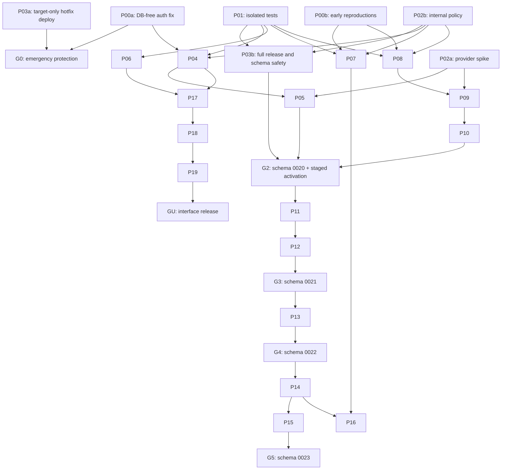

# Application Gap Remediation Implementation Plan

> **For agentic workers:** This is the Tier 1 product and delivery contract, not a line-by-line execution script. Immediately before starting an eligible task, use superpowers:writing-plans to create its Tier 2 execution plan with small failing-test-first steps, concrete code/query sketches, checks and rollback instructions; then use superpowers:executing-plans. Delegation requires authorization. Checkboxes here track deliverables, not uniformly sized coding steps.

**Goal:** Resolve the application defects identified in the gap review and establish measurable security, contact safety, reliability, accessibility, and release evidence for the remaining assessment gaps.

**Architecture:** Keep the existing Express/Postgres application, but establish shared boundaries for authorization, patient-contact decisions, durable call attempts, and recoverable post-call processing. Use database transactions and durable job ownership for correctness across concurrent requests and restarts. Deliver cumulative releases with explicit schema dependencies; do not assume every task can ship independently.

**Tech Stack:** CommonJS JavaScript, Express 4, `pg`, WebSockets, Supabase Postgres/Storage, iCallMate, the existing AI integrations, `node:test`, Docker Compose/Caddy, GitHub Actions, and proposed Playwright/axe development dependencies.

**Spec:** [CLAUDE_APPLICATION_GAP_REVIEW.md](CLAUDE_APPLICATION_GAP_REVIEW.md).

**Supporting context:** [Existing fix plan](CLAUDE_APPLICATION_GAP_FIX_PLAN.md) and [its review](CLAUDE_APPLICATION_GAP_FIX_PLAN_REVIEW.md). This is a new plan; those documents are preserved. R01–R18 below refer to that supporting review, not additional original application findings.

**Revision 2:** Incorporates [the review of this plan](2026-09-08-REMEDIATION_PLAN_REVIEW.md). C01–C14 dispositions appear below. Delivery now prioritizes an immediate DB-free authorization fix, bounded provider discovery, staged lifecycle activation and release-specific assurance. No confidence score is claimed without implementation evidence.

**Prepared:** 8 September 2026. **Source baseline:** `95015780b0c2f02e415e6bfeb37375e2a735ca4a`; current schema expectation `0019`.

## Implementation progress

- **P00a / F01:** HTTP authorization implementation completed locally on `codex/remediation-fixes`; `npm run test:hotfix` passes 22 tests, with no failures or skips. [Execution evidence](GAP_REMEDIATION_EVIDENCE.md).
- **P04, session/call privacy portions:** implemented locally; current account state governs session inspection. Four call read endpoints now return permitted operational fields and masked contacts to AGENT; media, transcripts, reports and supervisor payloads use an ADMIN-only working policy. Eight privacy tests, eight session tests and 22 hotfix tests pass. Full router coverage, remaining policy decisions, real database and browser verification stay open.
- **P05, legacy containment portion:** implemented locally; legacy callbacks default disabled and require the existing provider secret when explicitly enabled. Raw query logging is removed. `npm run test:remediation` covers 45 DB-free tests. Provider compatibility, recording retrieval restrictions, callback payload validation and event correlation remain open.
- **P06, database log portion:** implemented locally; configuration snapshots omit database credentials, and initialization/pool diagnostics use fixed safe messages. Current `npm run test:remediation`: 56 pass, no failures/skips. Image/runtime compatibility, Docker context proof, broader logs and incident assessment remain open.
- **Release status:** not deployed. G0 still requires P03a deployment isolation. P04 database-backed session/privacy checks and P05 callback protections remain open.
- **Current user-selected sequence:** groups 3–7, starting with P04 security/privacy, then P05–P19 and P20 evidence. Work proceeds one reviewable item at a time. P01/P02 prerequisite decisions and P03 release gates remain required where applicable; selecting product fixes first does not authorize a deployment or shared-UAT tests.
- **9 September continuation:** the user requested completion of all remaining work. P01 is being implemented first to enable safe real database regressions; subsequent fixes proceed one item at a time. Local Docker setup is included in that instruction. The user confirmed Supabase manages the deployed database; read-only dashboard inspection subsequently verified PostgreSQL major 17 in both projects (service build `17.6.1.166`). Supabase role/extension equivalence still needs separate verification.
- **P02 working contracts:** [Domain and policy decisions](APPLICATION_DOMAIN_CONTRACTS.md) and [provider capability matrix](ICALLMATE_CAPABILITY_MATRIX.md) record implementation choices and unresolved external evidence. These documents do not claim provider compatibility or completion of operational assessments.

## Scope, status, and execution rules

The original planning pass changed documentation only and did not run application tests or external operations. Implementation now proceeds item by item as recorded above. The earlier review's 74 passing tests remain historical evidence; only the specifically listed new checks verify current changes.

- Except for the implementation progress recorded above, F/A items remain **mapped, not implemented**. Every T/M assessment starts **open, evidence required**. Track implementation, isolated verification, UAT verification, and production observation separately.
- Paths below are repository-relative. Files marked **Create** do not exist yet; their commands become usable only after the named task implements them.
- Use the existing `node:test` and `node:assert/strict` conventions. Demonstrate the reported behavior failing before its fix and passing afterward. A missing module or matching source string is not sufficient regression evidence.
- Do not run the current unrestricted `npm test` or an environment-selected migration command before P01 proves isolation. Database fixtures currently select application configuration and can create immediately due work in shared UAT. P00a/P00b may run explicitly audited DB-free reproductions earlier, with startup/provider/DB access blocked; they do not wait for the full infrastructure task.
- Keep existing environment files and credential files out of test/build experiments. Synthetic credentials and fixture data belong only in runner-owned temporary resources.
- Use `dbTx()` for atomic application writes; it supplies a single checked-out client. Existing application SQL uses `?` placeholders through the compatibility wrapper; raw `pg` infrastructure code may use PostgreSQL placeholders.
- Migrations are append-only. Preserve this repository's numbered migration convention and custom runner. Do not renumber a distributed migration or switch to a second migration authority halfway through this work.
- New public-schema tables need RLS and explicitly reviewed grants; private processing tables must not become a public Data API. Verify actual database roles and view permissions rather than assuming comments describe deployed privileges. [Supabase API security guidance](https://supabase.com/docs/guides/api/securing-your-api).
- Preserve current unknown-consent behavior pending P02's business decision. Immediately enforce explicit refusal, suppression, inactivity, and wrong-number restrictions. Do not silently adopt a new contact policy through a bug fix.
- Runtime target: Node 24 LTS across development, CI, migration execution, and images. Node 20 is EOL; Node 24 is LTS at this plan's date. Select and lock the patch/image digest during P06, and recheck support before execution. [Official Node release status](https://nodejs.org/en/about/previous-releases).
- Add dependencies only for a demonstrated need and commit the lockfile. Playwright and axe are proposed development dependencies; there is no requirement to replace the application framework or add a separate queue service.
- Complete one reviewable change at a time, record its evidence, and commit its named files together. Save Tier 2 plans under `claude-docs/remediation-execution/Pxx-<scope>.md`, link their prerequisite commits and retain them with execution evidence. Generate them when dependencies are satisfied, rather than requiring every numerically previous task to merge. This planning request does not initiate implementation or deployment.

## Priority and complete finding coverage

“Source-backed” below means the reviewed code path remains relevant to the plan; it does not claim a new live reproduction. Conditional findings remain conditional until the listed assessment establishes actual exposure or impact.

| ID | Planning disposition and impact | Work and acceptance gate |
| --- | --- | --- |
| F01 | Critical, source-backed route/auth disagreement; sensitive handlers can be reached without intended permission. | P00a: immediate route/static-path denial; P04: expanded session/privacy verification. |
| F02 | High, source-backed legacy callback and recording-fetch trust gaps. | P05: authenticated callbacks and one retrieval policy across download/playback. |
| F03 | High: both services use `${APP_IMAGE}` and `up -d "$TARGET" caddy` reconciles the shared proxy/dependency graph. Recreation is conditional on effective configuration/image changes, not proven on every deploy. | P03a/P03b: target-only release; compare sibling app/proxy identity and database. |
| F04 | High, source-backed import replacement semantics can erase restrictions and omitted data. | P07: preview and persisted patch preserve omitted fields and restrictions. |
| F05 | High, source-backed consent vocabulary, negative intent, and suppression persistence disagree. | P08–P10: refusals survive stale events and prevent disallowed admissions. |
| F06 | High, source-backed identity hydration and retry gaps; provider timing remains unverified. | P09–P10: early media binds only to its durable attempt. |
| F07 | High, source-backed callback misassociation and outcome overwrites. | P09–P10: attempt A events cannot alter B; transport cannot erase disposition. |
| F08 | High, source-backed premature completion and unrecoverable processing claims. | P11: failure at every required persistence boundary recovers without duplicate effects. |
| F09 | High, source-backed disposable-queue joins and incomplete durable ownership. | P13: old/new manual and automatic history survive queue deletion. |
| F10 | High, source-backed inconsistent contact disclosure. | P04/P13: agent response policy covers history and retained records. |
| F11 | High, source-backed credential logging. | P06: synthetic secret values never appear in startup/error output. |
| F12 | High, source-backed unsafe local tests and skipped CI database coverage. | P01/P17: positively isolated DB and required database/browser jobs. |
| F13 | Medium, source-backed cooldown return-type and timestamp comparison defects. | P07/P09: unchanged instants preserve schedule; durable history enforces cooldown. |
| F14 | Medium, source-backed readiness and schema-recovery mismatch. | P03/P06: bounded DB-aware readiness and demonstrated recovery. |
| F15 | Medium, conditional stranded connected/unanswered attempt. | P10: missing callback/media-packet scenarios reconcile to an explicit state. |
| F16 | Medium, source-backed file-lifetime race. | P12: upload/transcription failures and stored-audio retries preserve recoverability. |
| F17 | Medium, source-backed null rating interpreted as low rating. | P14: positive unrated calls do not become recovery cases solely for missing rating. |
| F18 | Medium, source-backed sampled aggregates. | P14: full-period totals are independent of 25-row/6-item display limits. |
| F19 | Medium, source-backed name-based campaign attribution. | P15: renaming preserves one identity and counts spend once. |
| F20 | Medium, source-backed fixture cleanup assumption invalidated by retention migrations. | P01: the actual trigger fixture leaves no calls or dependent records. |
| F21 | Conditional credential inclusion; concrete archived-file exposure: present `feedback.db.archived-20260830` (94,208 bytes) is not excluded by `*.db`. Its contents/layers were not inspected. | P06: exclude archive and credential patterns; sanitized sentinel build proves behavior. |
| F22 | Conditional capacity/deadline concern; throughput not measured. | P09 and G2 T12/M04: shared atomic admission, uncertain-result reconciliation, measured limits. |
| F23 | Conditional scaling concern; fixed list caps are source-backed. | P16 and G5 T12/M13: reachable pagination, bounded imports, representative query/load evidence. |
| F24 | Confirmed configuration maintenance gap, distinct from a vulnerability claim. | P06: supported runtime boots the complete isolated application. |
| F25 | Source-backed permissive CSP; exploitability unassessed. | P19 and GU T03: enforced script policy plus authenticated security assessment. |
| F26 | Source-backed obsolete deployment script; actual usage unknown. | P03: one documented, rehearsed deployment/recovery path. |
| A01 | Source-backed hidden radios; browser behavior needs verification. | P18: full keyboard path reaches and changes call type. |
| A02 | Source-backed missing focus lifecycle; mounted behavior needs verification. | P18: one named dialog, focus containment and return. |
| A03 | Source-backed placeholder-only search. | P18: persistent associated label and verified accessible name. |
| A04 | Assessment gap, not a blanket conformance failure. | P17/P18 and GU T05: automated and human assessment of complete workflows. |

## Delivery sequence, sizing and release gates

**Product priority:** stop unauthorized actions and unwanted contact first, restore trustworthy call/history processing next, then improve reporting, scale and interface quality. Do not hold a verified critical fix for an unrelated large infrastructure or specialist assessment. Equally, do not release it through the known cross-environment deployment path.

| Release | Contents and prerequisites | Exposure controlled |
| --- | --- | --- |
| G0 — emergency protection, schema `0019` | P00a DB-free authorization fix plus P03a bounded target-only deployment rehearsal. Start P00b, P01 and P02a/P02b immediately alongside eligible work. | F01; minimal deploy isolation for this release. Full session/data/privacy review follows in G1. |
| G1 — contact/data protection, schema `0019` | P01, P03b, P04–P07 and P08's explicitly schema-free vocabulary/negative-intent/suppression fixes. Release verified smaller changes within this group as ready. | Forged callbacks, secret exposure, import resets and known refusal errors. Lifecycle races remain open until G2. |
| G2 — call lifecycle, schema `0020` | Durable part of P08 plus P09/P10; provider contract gate, bounded replay/shadow/canary and calling controls. | Duplicate/unknown submissions, wrong-attempt events, stale contact decisions and capacity. |
| G3 — recoverable processing, schema `0021` | P11/P12 with restart/fencing/storage recovery evidence. | Premature completion, abandoned work and recording races. |
| G4 — retained history, schema `0022` | P13; P14 follows after durable history/disposition are available. | Unattributed feedback, missing history and sampled metrics. |
| G5 — attribution and scale, schema `0023` | P15; P16 follows P07/P13/P14 and adds only measured index migrations. | Campaign identity and complete bounded lists/imports. |
| GU — interface release, no assumed new schema | P17 starts once P00a/P01/P04/P06 permit authenticated startup; P18/P19 follow. This lane need not wait for G5. | Keyboard/task accessibility, CSP and UI regressions. |

The assessment register names the exact releases it blocks. P20 coordinates evidence only; it is no longer a late umbrella implementation/assessment phase. A targeted G0 access/packaging/release check is required, while unrelated full penetration/load/voice programmes do not delay that hotfix.

### Sizing and staffing assumptions

Planning estimates, not measured commitments: one engineer-day is one focused day including implementation, focused tests, review and task documentation. Existing code is unfamiliar; estimate confidence is low-to-medium until P00b/P02a and the first P01 rehearsal. Specialist work below excludes checks already included in task estimates. Two engineers can work across independent lanes; they do not simultaneously edit the same lifecycle files/migrations without a designated integration owner.

| Task | Engineer-days | Sizing boundary |
| --- | --- | --- |
| P00a | 2–3 | Minimal real-route extraction/auth hotfix; no broad app rewrite. |
| P00b | 1–2 | Audited reproductions and reprioritization, not all 60 assessments. |
| P01 | 3–5 | Testcontainers provisioning plus project-specific isolation/migration guards. |
| P02a | 2–3 | Provider capability evidence/decision; external reply time is additional. |
| P02b | 2–3 | Internal policy, role and domain decisions. |
| P03 | 4–6 | Includes P03a 0.5–1 day; remainder P03b. |
| P04 | 2–4 | Session/privacy work beyond P00a; no duplicated extraction estimate. |
| P05 | 4–7 | Callback compatibility and constrained recording retrieval. |
| P06 | 2–4 | Redaction, context exclusions and runtime compatibility. |
| P07 | 3–5 | Import patch semantics and scheduling regression. |
| P08 | 4–7 | Schema-free correction plus durable contact-event integration. |
| P09 | 7–12 | Common admission, capacity, idempotency and uncertain results. |
| P10 | 7–12 | Identity/events/reconciliation plus rollout instrumentation; observation time separate. |
| P11 | 7–12 | Fenced stages, recovery and outbox. |
| P12 | 2–3 | Audio recovery using P11 infrastructure. |
| P13 | 4–6 | Migration, all writers/readers and deletion invariants. |
| P14 | 3–5 | Metric definitions and full-population queries. |
| P15 | 3–5 | Campaign identity/view/backfill integration. |
| P16 | 4–7 | Pagination, batched imports and representative performance. |
| P17 | 3–5 | Authenticated browser harness and release checks. |
| P18 | 3–5 | Complete keyboard/dialog workflows and focused manual checks. |
| P19 | 4–7 | Script/CSP inventory, migration and browser verification. |
| P20 | 1–2 | Evidence assembly/coordination only; assessment work is allocated below. |
| **Core total** | **77–130** | Sum of the above, including P03a once. |

Reserve **12–20 additional specialist-days** for targeted penetration/infrastructure testing, voice evaluations, recovery/performance exercises and staff/accessibility assessment beyond task-level checks. Reserve **18–30 engineer-days of contingency** for assessment-triggered fixes (about 20% of core plus specialist effort): total planning envelope **107–180 person-days**. An MFA implementation, material provider integration change or identity-data repair consumes an explicit new task from this reserve; these are not silently included as “assessment done.” Re-estimate if that reserve is exceeded.

With two engineers at roughly 70% implementation availability, specialist access and timely decisions, plan on approximately **4–7 calendar months** for the complete programme, not for first protection. G0 targets the first working week if safe packaging/deployment access is available; G1 targets roughly weeks 2–4; G2 roughly weeks 6–10 plus evidence dwell. These are initial ranges, not dates promised by this document. Rebaseline after five working days of execution and after the provider spike; publish actual versus estimated effort at each release.

### Dependencies and critical path

Arrows mean prerequisite completion for the named deliverable; tasks may prepare tests/design earlier. P02a and P02b start on execution day 1. An unresolved provider contract gates G2 activation, not schema-free fixes or P01 work. P03b is a common gate for every post-G0 release, including GU; it is shown once at G2 to keep the diagram readable. Targeted task tests still run before that operational gate.



G1 groups independently verified schema-free work after P03b; it is not a requirement to finish all P05 work before shipping P07. The principal implementation chain is **P01 → P08 → P09 → P10 → P11/P12 → P13 → P14/P15**. P02a/provider compatibility and P03b/schema recovery are external/operational gates on G2; shadow observation adds elapsed time without equivalent full-time coding effort. P16 and the GU lane are not prerequisites for core call safety.

### Integration strategy

The inspected checkout is `uat-kcpathlab`; `master` is the production branch named in current workflows. Use short-lived `codex/remediation-<task>` branches, review against the appropriate environment branch, and promote the tested commit/build identity through UAT to production. Protect the G0 path from an automatic full `npm test` or the old cross-environment deploy. One integration owner manages lifecycle contracts and migration allocation. Once a migration is shared for application/release, its number/content are immutable; fixes use a subsequent migration. Rebasing a short-lived branch is not itself a schema change, but must never rewrite applied/shared migration identity. New lifecycle code may merge disabled after expand-schema compatibility tests; retain one authoritative writer per attempt and activate separately through the G2 controls below.

### Fixed schema sequence

These names describe planned migrations, not files created by this document. If the repository advances before implementation starts, revise this entire table once before distributing any new migration; never repair ordering by renumbering deployed files.

| Migration | First consumer and complete contents | Required release dependency |
| --- | --- | --- |
| `0020_contact_and_call_attempts.sql` | P08–P10: patient contact revision/events; durable attempt identity, dispatch/transport/disposition state, writer version/cohort, event deduplication and unmatched/conflict/comparison records; indexes/constraints needed for admission and identity. Reuse `calls.idempotency_key` where suitable. | Compatible schema expansion, single-authority transition, provider contract, admission tests and G2 staged activation. |
| `0021_post_call_jobs.sql` | P11–P12: stage jobs, claim ownership/expiry/retries, uniqueness for automatic feedback/effects, notification outbox. | Workflow and helper completion ownership; restart/failure tests. |
| `0022_feedback_patient_ownership.sql` | P13: durable feedback patient link, backfill, writer invariant, deletion protection and necessary indexes. | All feedback writers, retained-history readers, and fixture cleanup updated. |
| `0023_campaign_identity.sql` | P15: campaign IDs on queue/attempt history, backfill, explicit compatible view projection, relevant keys/indexes. | Create/update/import writers, configuration projection, report grouping and UI updated. |

Each release updates `EXPECTED_SCHEMA_VERSION` and an explicit required-migration manifest in the same change. P03 replaces maximum-version-only validation with required-set validation and a tested compatibility bound. Fresh installs and upgrades from `0019` must both pass, including nonempty backfills, duplicate identifiers, and a failed intermediate migration.

Default rollout for an unproven schema transition is a bounded maintenance window: pause new admissions, drain/reconcile active work, capture a recoverable database/storage checkpoint, migrate the selected environment, boot and verify the new build, then resume. A previous image is a rollback option only when it has passed tests against the resulting schema. Otherwise use a rehearsed forward fix, or an explicitly chosen restore that accounts for writes since the checkpoint. Backup restoration and application rollback are different procedures.

### Migration volume, rehearsal and abort contract

Actual environment row counts and durations are **not measured in this planning-only task**. P03b's migration owner obtains them through an authorized bounded read-only inventory before each release; no claim is made that an exact `COUNT(*)` is cost-free on a large table. Start with catalog estimates/table sizes, then exact counts and duplicate/orphan checks where needed. Save counts, bytes, index sizes, lock contention, throughput, elapsed time and recovery time in `claude-docs/assessments/MIGRATION_REHEARSALS.md` with build/environment identity. An unmeasured production backfill cannot pass its release gate.

| Migration | Rows to measure / production-size rehearsal | Blocking-data and resumability decision |
| --- | --- | --- |
| `0020` | Patients needing contact revisions; all calls/provider IDs; existing idempotency keys; active/unresolved attempts. Rehearse measured volume plus 2× projected growth using deidentified/synthetic equivalents. | Duplicate scoped IDs or conflicting active ownership block constraint activation. Preserve rows, quarantine conflicts and perform reviewed repair. Transactional backfill rolls back as a unit; any large batch variant needs a checkpointed job before release. |
| `0021` | Calls by analysis status, existing feedback/supervisor effects and unfinished audio/transcripts. Measure recovery-job seeding and uniqueness validation. | Ambiguous legacy “completed” effects go to review; no blind historical notification replay. Seed jobs idempotently with stable call/stage/revision keys; retries resume without duplicate effects. |
| `0022` | Feedback linked by call/queue, missing/conflicting patient links, retained calls and deletion dependencies. Measure join backfill and constraint-validation duration. | Conflicting historical identity blocks enforcement for those rows until reviewed; never delete history to pass the migration. Small one-transaction migration is restartable after rollback; large repair/backfill uses resumable keyset batches. |
| `0023` | Campaign configs, queue rows and retained calls; ambiguous/unmatched normalized names and historical attribution. Measure view replacement/backfill/index time. | Only unique matches are backfilled. Unmatched rows remain explicitly unassigned; conflicting IDs need repair. Batch progress must use stable IDs and idempotent writes, not mutable campaign names. |

Initial maintenance budget per selected environment: **15 minutes total**, reserving at most **5 minutes for schema/backfill work** and the remaining time for drain/startup/checks or recovery. Use a 5-second lock timeout and a watchdog for the 5-minute migration budget; individual statement limits cannot replace the overall deadline. Rehearsal must complete within 70% of each budget at the selected volume before scheduling a release. If actual volume differs by more than 20% or the drain cannot fit, replan the window before starting. These are planning limits, not measured durations or an RTO promise.

At a budget breach, duplicate/identity conflict, unexpected row-count change, or failed invariant: stop new work, cancel the active transaction and verify rollback; retain admissions paused and inspect committed migration history. **Do not automatically restore the entire database**: earlier migrations may already be committed and new valid data may exist. Use the rehearsed compatible build/forward repair. Restore a checkpoint only through the explicit incident procedure with its data-loss consequences accounted for.

If rehearsal exceeds the budget, split the not-yet-shared release into nullable expansion, idempotent checkpointed backfill, then constraint enforcement. Online work is not automatically safe: require compatible readers/writers and verification of each batch. Add subsequent numbered migrations for later enforcement; update the sequence table and release manifests before distribution. Never edit or renumber an already shared/applied migration to retrofit this split.

### G2 lifecycle rollout: observe, canary, enforce, pause

P09/P10 include this work and its tests; maintenance alone does not prove the new provider matching contract.

1. **Replay first.** Run normalized captured/redacted provider fixtures through old-candidate and new-candidate matching functions without mutations or provider calls. Cover unknown IDs, delayed A-after-B, missing metadata, duplicate callbacks, early media and reconnects. Disagreement with the old phone matcher can be evidence of the intended fix; classify it instead of optimizing for zero raw disagreement.
2. **Safe observation.** Deploy compatible additive `0020` schema/code only after P03b checks. Compare both pure candidates for authenticated events; persist minimal redacted diagnostics with event/attempt identity, result and reason. The old latest-phone lookup is diagnostic only for ambiguous events. Any authoritative compatibility path must already require verified exact correlation and enforce contact policy; otherwise quarantine the event and pause the affected calling path. Do not retain known cross-attempt writes to collect telemetry.
3. **Runtime mode and one writer.** Persist an ADMIN-only, audited mode `observe|canary|enforce|paused` and config revision in the existing settings infrastructure. Apply the mode consistently at admission and stamp `writer_version`/cohort on the durable attempt. Every later event uses that owner; changing a flag never transfers an in-flight attempt between competing writers. Comparison never submits calls, writes outcomes or queues notifications.
4. **Canary.** Start in controlled UAT with provider fakes; any live provider compatibility test uses an explicitly authorized test destination. Then select a deterministic small production cohort from normal eligible traffic, cap new-path concurrency initially at 1, and expand only after the exit criteria pass. All cohorts retain the same refusal, admission-capacity and callback-authentication safeguards; a feature flag cannot disable them.
5. **Exit criteria.** Require at least 3 consecutive operating days and 100 naturally occurring attempts/500 relevant events, every unexplained mismatch investigated, zero wrong-attempt writes, zero duplicate submissions and zero explicit-refusal violations. Also require the synthetic rare-event matrix, including provider response loss, to pass. If normal volume is lower, extend observation or record a release-owner decision based on a longer representative window and controlled test evidence; never generate extra patient calls just to reach a quota. Do not call an unobserved path verified.
6. **Abort/rollback.** Any wrong-attempt write, prohibited contact, duplicate submission, lost ownership, or inbox/job threshold breach pauses new admissions for the affected scope, preserves events and alerts the operator. Continue authenticated event ingestion and owned in-flight processing. Roll back code only to a version compatible with `0020` and the recorded writer ownership; otherwise forward-fix while paused. Do not flip back to the unsafe phone matcher or redial uncertain attempts.

**Initial post-release indicators:** instrument in P09–P11, expose in the operator view, and validate alerts with a controlled sink. Owners may tighten thresholds after baseline measurement; the first two have no nonzero error budget.

| Indicator and denominator | Target / response | Owner |
| --- | --- | --- |
| Duplicate provider submissions for one logical admission, per 1,000 admitted requests | **0**; one confirmed duplicate pauses affected admission and starts incident review. | Backend/on-call |
| Submissions whose latest committed pre-dispatch policy forbids contact, including explicit refusal | **0**; one violation pauses affected calling. Report refusals arriving after submission separately and exercise best-effort cancellation. | Product safety/on-call |
| Eligible authenticated events unresolved after reconciliation | Oldest unresolved <5 minutes and depth ≤5; breach for 5 minutes alerts and holds cohort expansion. Wrong/ambiguous matches always quarantine. | Voice/on-call |
| Attempt identity completeness across emitted admission/event/job/effect records | ≥99.5% of eligible records correlated within 5 minutes; **100% before any mutating side effect**. Missing/invalid identity blocks that effect immediately. | Backend/on-call |
| Retry-exhausted technical post-call jobs, excluding policy-required human review | ≤1% of completed-call jobs over 7 days; ≥3 jobs or any critical suppression/finalization failure triggers triage. Show counts and denominator at low volume. | Backend/operations |
| Recoverable-stage completion after call end, excluding explicitly blocked provider input | ≥95% within 15 minutes initially; backlog >15 minutes alerts. Queue age and missing-input cases stay separately visible. | Operations |

Record raw counts and observation windows with every rate. Zero observed failures in a small sample is not proof of zero production risk. Observation and pause controls remain after cutover rather than being deleted with the temporary comparison code.

## Shared contracts for implementation

P02 records these decisions in `claude-docs/APPLICATION_DOMAIN_CONTRACTS.md` and P08–P13 implement them. The names below are proposed interfaces, not claims about existing exports.

| Module | Interface and responsibility |
| --- | --- |
| `src/app.js` | `createApp(deps) -> Express`: construct the real HTTP routing/middleware tree without listening, starting intervals, or opening provider/DB connections. Production bootstrap remains in `index.js`/`src/server.js`. |
| `src/contact-policy.js` | `evaluateContact({ patient, queue, history, now, limits }) -> { allowed, reason }`; history contains `attemptsToday: number` and `latestAttemptAt` (ISO string or null). Also `applyContactEvent({ tx, patientId, expectedRevision, event })` for versioned explicit transitions. |
| `services/outbound-admission.js` | `admitOutbound({ customerId, requestKey, actor, source, callType, agentId }) -> { accepted, callId?, attemptKey?, reason? }`; persist and reserve before provider I/O. `source` includes scheduler, manual/API, and diagnostic/test-call entry points. |
| `src/call-events.js` | `resolveAttempt({ attemptKey, providerAccount, providerCallId }) -> matched/unmatched/conflict` and `applyCallEvent({ tx, callId, event })`; no latest-phone selection. |
| `services/recording-fetch.js` | `fetchRecording({ url, policy, signal }) -> bounded readable stream`; one provider URL, DNS, redirect, size, content-type and timeout policy for background download and playback. |
| `services/post-call-jobs.js` | `claimJob({ workerId, now })` returns a job or null; `renewClaim({ jobId, claimToken })` and `completeStage({ jobId, claimToken, result })` enforce fenced writes and durable retries. |
| `services/feedback-store.js` | `saveFeedback({ tx, patientId, customerId, callId, source, reviewText, stars, effectKey })`; patient association and automatic-effect idempotency for every writer. |

Authoritative facts: `patients` owns identity/contact restrictions; `customers` owns one queue workflow; `calls` owns one attempt; provider events describe transport; analyzed patient statements produce disposition; stage jobs own processing completion; feedback belongs to the patient even when its queue entry disappears. Phone/name are lookup/display attributes, not event identity.

Transport and disposition are separate. Normalize current spellings such as `no-answer`, `no_answer`, `missed`, and `scheduled_initiated` through one compatibility adapter. Existing `calls.status`/`outcome` mirroring triggers must be accounted for; adding a new field alone does not separate existing writers.

| Incoming event | Allowed durable effect | Must preserve |
| --- | --- | --- |
| Media connected | Connection evidence for the identified attempt. | Answer remains unconfirmed until answer evidence exists. |
| Transport completed/no-answer/busy/failed | Monotonic transport transition; eligible transport-based retry decision only if no higher-priority disposition exists. | Analyzed callback, refusal, wrong-number state, and newer patient restrictions. |
| Explicit opt-out/refusal | Restrictive contact event plus suppression/retry cancellation in one transaction. | A later ordinary completion cannot reset the restriction. |
| Explicit wrong number | Suppression plus staff-review flag; retain statement provenance. | Historical patient identity is not automatically rewritten. |
| Analysis identifies callback | Disposition and next action for this attempt. Update shared queue workflow only if this remains its owning attempt. | Newer attempts and more restrictive contact events. |
| Analysis is positive/interested | Disposition only; consent changes require separate explicit evidence. | A positive result never implicitly grants consent or clears suppression. |
| Older/duplicate event | Idempotent no-op or attempt-local evidence; conflicts become reviewable events. | Newer workflow state, feedback uniqueness, and job ownership. |

## Implementation tasks

### P00a — Close the critical authorization bypass without waiting for a database

**Owner:** Backend/security. **Gaps:** F01; C02. **Dependencies:** audited current intended role policy only; no P01 or provider dependency. **Release:** G0 after P03a.

**Create:** `src/app.js`, `test/authorization-routes.test.js`, a minimal DB-free test dependency harness.
**Modify:** `index.js`, `src/authorization.js`, `src/api-routes.js`, affected `routes/*.js`, `package.json` and the emergency CI/release path.

- [ ] Extract only the app construction necessary to exercise the real middleware and registered routes. Mock DB/session lookup and provider transports before imports; block unexpected DB clients, dotenv loading, listeners, intervals and outbound network access. Keep public login/health/provider contracts and the current intended AGENT/ADMIN matrix.
- [ ] Add failing actual-route tests for anonymous/AGENT/ADMIN requests, path casing/slashes/encoding/raw dot segments and signed/padded IDs. Replace vulnerable path-spelling checks with middleware on protected route families/registered operations; protect HTML outside generic static fallback. Assert denied requests never execute sensitive handlers.
- [ ] Run the explicitly named test using an audited `test:hotfix` command; include valid login/role flows with fakes and synthetic HTTP/static checks. Do not run unrestricted `npm test`, claim real session-revocation coverage, or expand this into wholesale app refactoring.
- [ ] Deliver a schema-free G0 candidate with P03a target-only packaging/deployment verification. Keep P04's DB-backed session and response-privacy coverage open. The fix does not wait for P00b's full reproduction inventory.

**Done when:** real route dispatch rejects the reported bypass forms, authorized synthetic requests still work, and the safe G0 release gate passes. Missing provider capabilities do not block this work.

### P00b — Reproduce high-value defects before committing to the full schedule

**Owner:** Backend/QA. **Gaps:** F04, F05, F08, F13, F17–F18 plus severity triage. **Dependencies:** no live DB; P01 only for later SQL verification. **Timebox:** 1–2 engineer-days starting alongside early work.

**Modify/Create:** focused tests under the corresponding P07–P14 test paths; record baseline evidence in `claude-docs/GAP_REMEDIATION_EVIDENCE.md`.

- [ ] Exercise actual existing import-plan, intent, pipeline and report functions with audited mocks. Prioritize omitted import fields, negative intent, late persistence failure, null rating and sampled report totals. For the latter, a query-aware fake must honor the current LIMIT and return 30+ synthetic calls; confirm real SQL behavior after P01.
- [ ] Reproduce F13 through the existing scheduling update/cooldown callers with PostgreSQL-shaped `Date` values and numeric counts. Testing the proposed `sameInstant()` helper, which does not yet exist, would not reproduce the current defect.
- [ ] Capture failing expected-behavior assertions before the fix, then carry those tests into the task branch and demonstrate green after implementation. Do not make expected failure a permanently passing release check. Keep inherited source observations distinct from new reproductions.
- [ ] Record confirmed/not-reproduced/conditional/needs-DB verdicts and revise scope/estimates. Do not dismiss security findings solely because one mock failed to reproduce them; inspect the real route/runtime assumptions. Stop at the timebox and let individual task regressions complete remaining coverage.

**Done when:** the highest-value scenarios have reproducible evidence or a precise missing-input explanation; the schedule is updated without delaying G0.

### P01 — Make tests and migrations demonstrably isolated

**Owner:** Backend/QA. **Gaps:** F12, F20; R01, R05, R18. **Dependencies:** none.

**Create:** `scripts/test-isolated.js`, `scripts/test-migrate.js`, `test/support/database.js`, `test/support/provider-fakes.js`, `test/database-isolation.test.js`, `test/fixture-cleanup.test.js`.
**Modify:** `scripts/migrate.js`, `db.js`, `package.json`, `package-lock.json`, `test/support/fixtures.js`, `test/schema-triggers.test.js`, `test/daily-call-limit.test.js`, `test/retention.test.js`, `test/outbound-context.test.js`, every other test importing DB/startup/providers, and both CI/deploy workflows.

- [ ] Inventory database creation, `.env` loading, provider requests, timer startup, and fixture cleanup before executing tests. Separate an audited unit-file manifest from database/browser groups.
- [ ] Use pinned `@testcontainers/postgresql` development tooling for ephemeral PostgreSQL provisioning and container lifecycle. Keep `scripts/test-isolated.js` a thin orchestration/ownership wrapper; disable reuse and define cleanup on success/failure/interruption. Select a PostgreSQL image matching the deployed major once verified. The library supplies connection details, not proof of safe application behavior. [Official PostgreSQL module documentation](https://node.testcontainers.org/modules/postgresql/).
- [ ] Implement the project-specific run identity and endpoint guard in both `db.js`'s test connection path and the test migration entry point, before constructing a DB client. Permit only the endpoint/database/user owned by the current runner; reject arbitrary supplied URLs, remote Docker targets and aliases without an explicit supported ownership contract. Production connection configuration remains separate.
- [ ] Verify effective port bindings and egress on macOS Docker Desktop and Linux CI. Require loopback-only published ports or run the test workload entirely on an isolated internal network without publishing the DB. Testcontainers network creation/port mapping alone does not establish egress blocking or loopback binding; use a small verified Docker-network adapter where needed, and fail closed if isolation cannot be established. [Official networking documentation](https://node.testcontainers.org/features/networking/).
- [ ] Pass a minimal child environment, not inherited application credentials. Set `DATABASE_URL` explicitly to the owned target before importing DB code. Suppress implicit dotenv loading in the test path. A variable called `TEST_DATABASE_URL`, a database-name suffix, or URL inequality alone does not prove isolation.
- [ ] Refactor migrations into an import-safe `runMigrations({ connectionString, migrationsDir, expectedVersion })` function. The guarded test entry point supplies the runner-owned connection; the production CLI resolves deployment configuration separately. Validate ownership before constructing a `pg.Client`/`Pool`.
- [ ] Use UUID fixture identities, no timestamp-derived dialable numbers, disabled scheduler/digest/inbound work, provider fakes and enforced egress blocking. Provision only the extensions/roles actually required by the migration set; test Supabase role/RLS behavior separately with equivalent restricted roles.
- [ ] Fix the actual schema-trigger fixture's cleanup in `finally`: feedback/supervisor dependents, calls by both call ID and durable patient ID, queue entries, patient, then pool close. Track IDs before any assertion can fail. Clean only runner-owned data/resources, including on SIGINT and failed migration.
- [ ] Add subprocess tests proving unsafe/missing/alias configurations create zero DB clients, migrations resolve the intended target, repeated bootstrap is idempotent, and cleanup survives an injected assertion failure. Demonstrate fresh migration plus real database tests with zero unexpected CI skips.
- [ ] Expose the following commands and use them consistently throughout this plan. Land `package.json`, lockfile, test discovery and both workflow invocations in the same commit. Preserve `test:hotfix`; make `npm test` a safe documented alias, never a silent empty glob. In CI, absent disposable infrastructure or zero discovered required tests is a failure; safe local unit execution may report database coverage as not run.

```text
npm run test:unit
npm run test:db
npm run test:db -- --file test/schema-triggers.test.js
npm run test:browser
npm run test:isolated
```

`test:db`/`test:browser`/`test:isolated` own provisioning, guarded migration, execution, and cleanup. Never substitute `TEST_DATABASE_URL=... npm run migrate`. Commit after zero-connect rejection and disposable execution evidence are recorded.

### P02 — Establish policy, trust boundaries, and ownership

**Owner:** Technical lead with product/operations. **Gaps:** T01–T04, T07–T11, M01–M11, M14–M15. **Execution:** two separately schedulable deliverables below start on execution day 1; P01 is required only for DB-backed experiments.

**Create:** `claude-docs/APPLICATION_DOMAIN_CONTRACTS.md`, `claude-docs/ICALLMATE_CAPABILITY_MATRIX.md`, `claude-docs/GAP_REMEDIATION_EVIDENCE.md`.

#### P02a — Provider capability spike

**Owner:** Voice/backend integration lead. **Timebox:** 2–3 engineer-days; issue a capability decision by the end of execution working day 3 even if external answers have not arrived.

- [ ] Check existing integration documentation/redacted payloads for callback authentication, scoped stable call IDs, attempt metadata echo, status lookup, submission idempotency, hangup and recording origins/redirects. Classify each as verified, unsupported or unknown, with evidence.
- [ ] Prepare a concise provider-question brief on day 1. The product/integration owner sends it through an authorized channel; this plan and its executor do not independently authorize messages to iCallMate. External waiting time is tracked separately from engineering effort.
- [ ] At day 3, unknown/no authentication means unauthenticated legacy mutation routes stay disabled; recording fetch stays closed except individually verified origins. Unsupported stable correlation means affected automated calling cannot activate G2. Unsupported idempotency/status lookup means durable unknown-submission/manual reconciliation with no automatic redial. Do not enable a phone-recency fallback to bypass the gate.
- [ ] Record operational consequences and the next decision date. Backend safety work continues while the owner obtains evidence or evaluates an alternative supported provider integration as a newly sized task. A disabled feature is containment, not a claim of restored capability; keep the unmet F02/F06/F07 requirement open.

#### P02b — Internal policy and domain ownership

**Owner:** Product owner and technical lead. **Timebox:** 2–3 engineer-days, parallel to P02a. Existing intended role restrictions govern G0 without waiting for new product policy.

- [ ] Inventory every route/method, role, protected page, export, recording, transcript, webhook, and WebSocket boundary. Preserve existing intended AGENT permissions, including support-ticket creation; explicitly decide recording/transcript access because audio/free text can reveal contacts even when phone fields are masked.
- [ ] Draw the data flow from patient/import through provider/media, AI, storage, reports, notification services, logs, and backups. Record actual environment/service-account boundaries, including the current shared Gmail key mount.
- [ ] Record contact transition rules, scope of opt-out, handling of `unknown`, business hours/timezone, daily-limit identity, manual override policy, retention/deletion, and call-pause semantics. Assign product/operations decisions to accountable roles before dependent rollout.
- [ ] Consume P02a's capability matrix when making provider-dependent design decisions; internal contact/privacy/role decisions do not wait for unrelated provider answers.
- [ ] Define the shared contracts above and a route/role matrix. Add an evidence register with one row per F/A/T/M ID: status, owner, code/PR, test command/result, environment, evidence path, remaining risk, release trigger.

**Done when:** dependent tasks have explicit rules and provider fixtures. Unknown policy/provider behavior is a named decision gate, not an invented assumption embedded in code.

### P03 — Isolate releases and establish schema recovery

**Owner:** Platform/backend. **Gaps:** F03, F14, F26; R02, R15. **Dependencies:** P03a below is DB-free and starts with P00a; P03b needs P01 and P02b environment decisions.

**Modify:** `.github/workflows/deploy.yml`, `.github/workflows/ci.yml`, `docker-compose.prod.yml`, `scripts/deploy-prod.sh`, `scripts/migrate.js`, `db.js`, `src/api-routes.js`, `README.md`.
**Create:** `src/schema-contract.js`, `test/deployment-isolation.test.js`, `test/schema-upgrade.test.js`, `claude-docs/DEPLOYMENT_AND_RECOVERY_RUNBOOK.md`.

#### P03a — Minimal safe G0 release path (0.5–1 day within P03)

- [ ] Prepare a schema-free emergency workflow using audited `test:hotfix`, sanitized image context and the existing supported build mechanism. Include archive/credential exclusions before building; do not let the existing unrestricted test or auto-UAT deploy run as a side effect of merging the hotfix.
- [ ] Pin both currently intended environment images in an explicit host config, preserve registry login/working directory, and use a locked target-only restart with no dependency/proxy recreation. Skip migration for this verified `0019`-only hotfix and preserve the previous target image/configuration.
- [ ] Rehearse with synthetic sibling services and inspect the effective config: target image changes, sibling and proxy identities do not. Bound health/build verification and demonstrate target-only rollback without schema change. If target isolation cannot be established, contain affected protected operations using a verified access boundary until the safe path is ready; never knowingly use the coupled workflow for speed.

#### P03b — Complete environment and schema release controls

- [ ] Replace shared image interpolation with required `PROD_APP_IMAGE` and `UAT_APP_IMAGE`, persisted together on the host. Remove `APP_IMAGE` fallback. Separate host Compose interpolation data from application `.env.prod`/`.env.uat` files.
- [ ] Deliver versioned Compose/proxy configuration to the host and verify its digest before activation. Preserve `cd /opt/app`, registry login, correct permissions and secret-safe output. Persist both image identities through an atomic file update under a shared host lock.
- [ ] Serialize by destination environment and lock shared configuration/proxy changes across environments. Pull and restart only the selected app service with dependency recreation disabled; manage Caddy changes separately. Compose can recreate changed services; `--no-deps` controls linked-service startup. [Docker Compose reference](https://docs.docker.com/reference/cli/docker/compose/up/).
- [ ] Retain recoverable prior images/configuration instead of pruning away recovery assets during deployment. Update or retire the obsolete `app`/`nginx` deployment script and point README to the single supported runbook.
- [ ] Add required migration-set/compatibility checks using P01's import-safe runner. Check migration identity/duplicates before execution, close clients in `finally`, and ensure a partial migration failure is not reported as a safe old-image rollback.
- [ ] Complete the migration-volume inventory, production-size rehearsal, duplicate/backfill audit and abort/resume evidence defined above before each schema release. Prepare an expansion/backfill/enforcement split if the bounded maintenance rehearsal fails; never improvise it during production migration.
- [ ] Use the existing DB-aware `/health` as a starting point. Add bounded dependency checks and separately verify expected build SHA/image identity. Proposed rollout deadline: 180 seconds; each external probe has 2-second connection and 5-second total timeout. A static login page is not readiness.
- [ ] Rehearse on isolated sibling services: UAT update, stale build serving 200, database outage, missing host config, conflicting releases, failed migration, restart and recovery. Compare sibling container ID/image and schema before/after; parse effective Compose config and assert exactly two distinct image definitions.

**Verify:** `npm run test:db -- --file test/schema-upgrade.test.js` and isolated Compose deployment tests. Save measured drain/recovery duration and image/schema identities. No schema-changing release precedes this gate.

### P04 — Bind authorization to actual routes and shape sensitive responses

**Owner:** Backend/security. **Gaps:** remaining F01/session coverage, F10, T02; R03, R18. **Dependencies:** P00a, P01 and P02b route/role decisions. The critical route fix has already been delivered by P00a.

**Create:** `src/call-serialization.js`, `test/call-response-privacy.test.js`.
**Extend:** `src/app.js` and `test/authorization-routes.test.js` from P00a.
**Modify:** `index.js`, `src/authorization.js`, `src/auth.js`, `src/api-routes.js`, affected `routes/*.js`, `src/patient-rules.js`.

- [ ] Retain P00a's route-bound authentication/role enforcement and protected static dispatch; expand coverage to every router and consistently reject invalid/overflow IDs. Independently created routers require deliberate configuration. [Express 4 routing API](https://expressjs.com/en/4x/api/).
- [ ] Apply the P02 response policy to recent/list/detail calls and nested patient/queue joins, removing restricted phone/email/provider-payload fields for AGENT. Apply separate decisions to recording/transcript endpoints; do not claim field masking anonymizes speech.
- [ ] Use actual HTTP requests for anonymous, AGENT, ADMIN, expired/deactivated/demoted sessions. Include casing, trailing slash, repeated slash, percent encoding, raw dot segments, signed/padded IDs and all sensitive verbs. For dot segments use raw HTTP request targets so the client does not normalize the test away.
- [ ] Assert unauthorized requests leave sensitive-handler, database-write and provider spies untouched. Assert valid authorized workflows still work and role revocation takes effect within P02's defined session bound.

**Verify:** `npm run test:unit -- --file test/authorization-routes.test.js` and `test/call-response-privacy.test.js`, plus guarded DB tests for current-user/session checks. Commit route enforcement and its behavioral matrix together.

### P05 — Authenticate callbacks and constrain every recording fetch

**Owner:** Backend/security. **Gaps:** F02, T03–T04, M10–M11; R04. **Dependencies:** P00a HTTP boundary and P01/P02b; use P02a's verified capabilities or explicit day-3 containment decision. Playback permission changes depend on P04.

**Create:** `services/recording-fetch.js`, `test/recording-fetch.test.js`, `test/legacy-callback-auth.test.js`.
**Modify:** `src/api-routes.js` (`/call/status`, `/call/recording-status`, `/api/icallmate/callback`, recording playback), `src/icallmate-webhook.js`, `services/post-call-pipeline.js`, `services/supabase-storage.js`, configuration examples.

- [ ] Establish which legacy routes have active provider consumers. Default unused legacy routes to disabled; required routes get the verified provider-compatible authentication mechanism and reject missing/invalid credentials before mutation. Never invent signature support the provider does not supply.
- [ ] Normalize/validate callback schema and payload size; constrain recording metadata independently of authentication. Replay-safe attempt/event application is completed in P10; do not close that portion based on a shared secret alone.
- [ ] Implement one retrieval service used by both pipeline download and playback proxy. Allow exact configured HTTPS origins/ports, reject userinfo and IP literals, validate all resolved addresses, and bind the connection to a validated address while retaining correct TLS server name. Validate each redirect independently or reject redirects until the provider contract permits them. A separate DNS check followed by an unpinned fetch is insufficient.
- [ ] Bound redirects, bytes, response type and duration. Proposed initial test limits: 3 redirects, 25 MiB, 30 seconds total; P02a and G2 T12/M04 provider/capacity evidence set production values. Stream playback with backpressure and cancel upstream when the client disconnects.
- [ ] Fetch stored objects through trusted storage configuration/object keys, not provider-controlled storage origins. Authorize before issuing signed URLs and avoid logging signed query strings.
- [ ] Test both entry points against allowed fixtures, private/loopback/link-local/IPv6 addresses, mixed DNS answers, DNS rebinding, forbidden redirects, oversized/slow streams and client cancellation. Forbidden requests must never reach the network spy. Missing provider contract blocks affected recording rollout rather than silently opening the allowlist.

**Verify:** focused callback and retrieval unit/integration tests, followed by provider-fixture compatibility through the isolated harness.

### P06 — Remove secret leakage and move to a supported runtime

**Owner:** Platform/backend. **Gaps:** F11, F21, F24; R05. **Dependencies:** P01; P03 for rollout.

**Modify:** `src/config.js`, `.dockerignore`, `Dockerfile`, `package.json`, `package-lock.json`, both workflow files and `README.md`.
**Create:** `test/config-redaction.test.js`, `test/build-context.test.js`.

- [ ] Replace raw database URL logging with presence/environment metadata. Audit startup and connection-error paths for URLs/tokens. Prefer complete secret omission to a generic prefix/suffix redactor for connection strings.
- [ ] Test synthetic secrets containing URL encoding, query credentials and short/long values; capture console/error output and assert no password, token, or full URL appears.
- [ ] Complete the G0 minimum exclusions with root/nested Gmail keys, service-account files, OAuth client-secret names and archived databases/backups. Explicitly cover present `feedback.db.archived-20260830`; `*.db` does not match its suffix. Build a temporary sanitized fixture context containing only dummy sentinels, not that real database; never `touch` or delete a real credential path in the repository.
- [ ] Prove sentinel bytes are absent from effective context/image layers and that removing the exclusion makes the test fail. Record that no genuine credential was copied into the experiment.
- [ ] Select a Node 24 patch/digest, align all jobs including migration execution and local engine guidance, and refresh the lockfile only as needed. Boot the real image with disposable DB, seeded administrator, synthetic required configuration and disabled outbound work.
- [ ] Exercise login/password hashing, representative Excel import, PDF/font generation and WebSocket/provider-fake paths. `node --version` alone does not prove startup or native dependency compatibility.

**Verify:** redaction and context tests plus authenticated isolated container startup/readiness. Actual log/history secret exposure is assessed in G1 T10; confirmed or credibly suspected compromise creates an explicit credential-rotation/incident task without waiting for the rest of this programme.

### P07 — Preserve import fields and compare schedule instants correctly

**Owner:** Backend/frontend. **Gaps:** F04, F13 scheduling; R07. **Dependencies:** P01/P02.

**Modify:** `src/patient-import.js`, `src/patient-rules.js`, `routes/patients.js`, `routes/customers.js`, `public/patients.html`, `test/patient-import.test.js`.
**Create:** `src/schedule-time.js`, `test/patient-import-route.test.js`, `test/schedule-edit.test.js`.

- [ ] Carry actual field presence from header parsing into each planned update, its server-held preview and confirmation. Normalize create payloads separately from update patches; the prior plan's proposed `IMPORTABLE_FIELDS` approach alone does not establish presence (that export is not current application code).
- [ ] Adopt explicit patch semantics: absent columns preserve existing values; present blank optional cells clear that optional value; present blank required name/phone is an error. The preview shows clears distinctly. Ordinary imports never modify consent, suppression or patient status, even if an upload introduces those headers.
- [ ] Revalidate identity and row version at confirmation; if a patient changed after preview, require a refreshed preview rather than replacing newer data. Reject conflicting reference/phone matches and duplicate update targets with row-specific errors.
- [ ] Compare schedule timestamps by epoch milliseconds. Preserve the existing validation of past dates; reject invalid nonempty timestamps before comparing. Only a real changed future schedule may reset attempts/workflow.

```js
// Proposed src/schedule-time.js core, after route input validation.
function sameInstant(a, b) {
  const epoch = value => value == null || value === '' ? null : new Date(value).getTime();
  return epoch(a) === epoch(b);
}
// Regression assertion for test/schedule-edit.test.js:
assert.equal(sameInstant('2026-09-09T10:00:00.000Z',
  new Date('2026-09-09T10:00:00Z')), true);
```

- [ ] Test the real preview/confirm route with a refused inactive patient containing notes, dates and email: omitted columns preserve values; explicit blanks follow the rule; safe updates change only intended fields. Test unrelated edits on future callback/retry schedules with PostgreSQL `Date` values and timezone-equivalent strings; attempts/status remain unchanged.

**Verify:** unit import tests and guarded `test/patient-import-route.test.js`/`test/schedule-edit.test.js`. Ship the data-preservation fix early; admission races remain P08–P10 work.

### P08 — Make contact restrictions authoritative and monotonic

**Owner:** Backend/product. **Gaps:** F05, M07, M09; R06, R09. **Dependencies:** P01/P02; durable revision portion ships with P09/P10 and `0020`.

**Create:** `src/contact-policy.js`, `test/contact-policy.test.js`, `test/contact-event-races.test.js`.
**Modify:** `src/queue-rules.js`, `src/call-management.js`, `src/scheduler.js`, `routes/customers.js`, `routes/patients.js`, `services/call-orchestration.js`, `src/patient-rules.js`; contribute to `0020_contact_and_call_attempts.sql`.

- [ ] Use persisted `unknown|granted|refused` everywhere. For legacy API `denied`, either map to `refused` in one compatibility boundary or reject with a field error; choose and document one behavior. Fix `computePriorityScore` in `services/call-orchestration.js`, automatic queueing, manual calls, scheduler and workflow validation as well as the obvious guards.
- [ ] Evaluate explicit negative phrases before positive interest, using patient turns rather than assistant scripts as evidence. Preserve the existing suppression policy for recognized `not_interested`/`wrong_number`; distinguish that calling restriction from an unsupported legal-consent inference.

```js
const { detectConversationOutcome } = require('../services/call-orchestration');
assert.equal(detectConversationOutcome({
  transcriptText: 'CUSTOMER: I am not interested.'
}), 'not_interested');
```

- [ ] Remove consent initialization/writes from stale customer snapshots and automatic consent grants on ordinary completion. Persist explicit contact events with patient ID, source attempt/actor, evidence reference, expected contact revision, new revision and timestamp. A stale permissive update fails; staff restoration of contact requires a separately authorized current-revision event.
- [ ] In `dbTx`, lock the patient, apply the contact event, cancel newly disallowed retries/queue work, and persist related attempt outcome effects atomically. Enforce suppression and review flags on `patients`, not removed customer columns. Ordinary transport updates do not write patient consent.
- [ ] Interleave refusal with old completion, old analysis, staff edit and queued dispatch using two DB connections/barriers. Inject failure between related writes and assert rollback. A refusal committed before admission's dispatch decision prevents submission; already submitted/in-flight calls follow documented cancellation behavior rather than an impossible retroactive guarantee.

**Verify:** literal negative-intent regression, all consent vocabulary callers, and guarded transaction/race tests. Record remaining provider cancellation limitations.

### P09 — Reserve capacity and persist attempt identity before provider submission

**Owner:** Backend/platform. **Gaps:** F06–F07, F13 cooldown, F22, M03–M04, M07–M08; R08, R16. **Dependencies:** P01, P08 policy and P02a capability decision; `0020` with P10. Unsupported provider capabilities use the documented restricted mode; G2 activation still requires its evidence gate.

**Create:** `services/outbound-admission.js`, `test/outbound-admission.test.js`, `test/provider-uncertainty.test.js`.
**Modify:** `src/call-management.js`, `src/scheduler.js`, `services/icallmate.js`, `src/api-routes.js`, `routes/calls.js`, `routes/test-call.js`, `routes/test-ai-call.js`, related diagnostic service entry points, settings/API/UI; create `0020_contact_and_call_attempts.sql` with P08/P10.

- [ ] Route every provider submission through the shared admission boundary. A diagnostic route is not exempt from capacity/authentication; tests use provider fakes, not a production bypass. Existing endpoint response shapes get adapters for the new admission result.
- [ ] Under a consistent transaction lock order, reserve global capacity and lock patient/queue state; recheck pause, activity, suppression, consent, wrong-number/review flags, schedule/business hours, daily limit and cooldown from current durable history. Use a database lock/row reservation, not count-then-submit in separate transactions.
- [ ] Preserve `countOutboundCallsToday(phone) -> number` for current consumers; introduce a separate `{ attemptsToday, latestAttemptAt }` query for admission. Include retained calls via durable patient identity and normalized destination, current reservations and uncertain submissions; queue deletion must not reset contact limits. Use Asia/Kolkata day boundaries and elapsed time for cooldown.
- [ ] Allocate one durable attempt/request key before external I/O, reuse the existing `idempotency_key` column where possible, and record patient/queue IDs, destination snapshot under role protection, provider-account scope, contact revision and decision reason. Concurrent replay of one request key returns the same attempt; mismatched payload reuse returns conflict.
- [ ] Dispatch only an owned reserved attempt, rechecking revision/pause immediately before the serialized submitting transition. Provider network I/O stays outside the DB transaction. Proposed request deadline is 30 seconds, subject to P02 provider evidence.
- [ ] Distinguish `rejected` from `submission_unknown`. Lost response after provider acceptance retains attempt identity and capacity; do not automatically redial or release by age. Use verified provider idempotency/status lookup where available; otherwise require operator reconciliation, with visible unresolved state and alerting.
- [ ] Add the ADMIN pause/resume control, audited lifecycle mode/revision and active/uncertain-attempt view described in G2 rollout. Stamp attempt writer ownership at admission. Pause prevents new admission; stopping active calls is a separate action with provider-confirmed results. G2 M08/T12 establishes spend-limit behavior before claiming a hard monetary cap.
- [ ] Test N/N+1 reservations, two workers, scheduler plus manual initiation, double click, retained-history cooldown, midnight boundaries, refusal/pause races, crash before/after submission, and accepted-with-lost-response. Assert actual provider submissions, not merely count-query results.

**Verify:** guarded concurrent admission/provider-uncertainty tests. `0020` releases only after P08–P10's entire lifecycle contract passes.

### P10 — Match events exactly and reconcile the call lifecycle

**Owner:** Backend/voice. **Gaps:** F06–F07, F15, M10; R08–R09, R11. **Dependencies:** P09/P02 provider fixtures; contributes to `0020`.

**Create:** `src/call-events.js`, `test/call-event-ordering.test.js`, `test/media-identity.test.js`, `test/unanswered-reconciliation.test.js`.
**Modify:** `src/api-routes.js`, `src/call-management.js`, `src/websocket-bridge.js`, `src/scheduler.js`, `services/icallmate.js`, `services/call-orchestration.js`, affected state readers/trigger compatibility.

- [ ] Correlate authenticated attempt metadata and scoped provider ID. Unknown supplied IDs remain unmatched in the durable inbox; conflicting IDs go to review. Do not fall back to latest phone. Disable ID-less compatibility by default; enable it only if P02 proves a unique eligible attempt contract with tests.
- [ ] Audit existing duplicate provider IDs before adding uniqueness. Preserve historical rows and report ambiguous associations; never silently delete/merge them to make an index succeed. New attempts cannot reuse an active scoped provider identifier.
- [ ] Preinserted attempts allow early media to bind before the provider response. Direction/type metadata is supplementary. Set hydration complete only after valid call/patient/queue identity is attached; clear failed lookup promises and use bounded backoff. Attach a later provider ID to an already bound session without selecting a different call.
- [ ] Start a bounded unaffiliated-session deadline even before hydration; attach the attempt hard-duration timer when identity becomes available. Hangup, transcript and recording ownership must use that attempt. Never leave unassociated media running indefinitely because `callId` is missing.
- [ ] Apply the shared transport/disposition transition table at every writer, including callbacks and `applyCallOutcomeWorkflow`. Deduplicate events; an older attempt may update its own history but cannot reset a newer attempt's shared queue schedule. Remove direct callback writes that overwrite disposition before workflow evaluation.
- [ ] Reconcile connected-but-unanswered sessions and media closes without packets using explicit connection/answer/terminal evidence. Update both selection and conditional-write predicates in the existing reconciler, which currently filters `calls.outcome`, and test missing callbacks. A local timeout alone is not proof a provider call ended; unresolved active calls retain reservation/review state.
- [ ] Test A callback after B, supplied unknown ID with matching phone, duplicate terminal callback, early media, hydration miss then match, conflicting metadata, late provider ID, callback disposition followed by transport completion, completion followed by refusal analysis, and restart without callback.
- [ ] Implement the G2 replay/comparison instrumentation and per-attempt writer ownership, then test mode changes during active calls, comparison failure, duplicate delivery across a mode flip and pause/rollback. Verify comparison has no business mutations/provider submissions and unknown/conflicting identity is quarantined. Complete the operating-day/event-volume gate before widening the canary.

**Verify:** event/media/reconciliation suites plus admission integration and G2 rollout evidence. Pass conditions include correct recording, transcript, retry, suppression and hangup ownership, not just matcher return values. A deployed disabled implementation is not completed cutover.

### P11 — Make post-call completion durable, fenced, and recoverable

**Owner:** Backend/platform. **Gaps:** F08, T09, M02–M03; R10–R11. **Dependencies:** lifecycle release; ships with P12 and `0021`.

**Create:** `services/post-call-jobs.js`, `services/notification-outbox.js`, `test/post-call-recovery.test.js`, `test/post-call-claim-fencing.test.js`, `supabase/migrations/0021_post_call_jobs.sql`.
**Modify:** `services/post-call-pipeline.js`, `services/call-analysis.js`, `services/call-orchestration.js`, `src/server.js`, `src/api-routes.js`, `src/websocket-bridge.js`, notification invocation sites and schema expectation.

- [ ] Persist a unique stage job per call/stage/input revision. Model recording acquisition, transcription, analysis computation and finalization separately. Store status, attempt count, next run, claim token/expiry, error code and completion time; do not log sensitive raw inputs as errors.
- [ ] Atomically claim due work with row locking/`SKIP LOCKED`, renew leases during long operations, and require the current claim token for every stage write. Finalization locks/verifies the claim in the same transaction as its effects; a replaced worker cannot overwrite a newer result.
- [ ] Start a bounded recovery scan at boot and periodically, independent of callback arrival. Use retry delays of 1, 5, 15, 60 and 240 minutes as an initial policy, then visible manual-review state; provider-specific limits can reduce retries. A maximum retry count is not successful completion.
- [ ] Remove whole-job completion writes from both the pipeline and `storeCallAnalysis`. Helpers persist their own data only. Finalize required analysis fields, automatic feedback, patient restrictions, queue/attempt effects, supervisor records and outbox enqueue in one transaction, then mark analysis completed.
- [ ] Keep external email/Slack/CRM delivery outside the finalization transaction in its own durable outbox. Use unique effect keys. For destinations without idempotency, expose ambiguous delivery after crash; do not promise exactly-once delivery when the provider cannot guarantee it.
- [ ] Backfill/reconcile old `processing` and prematurely `completed` rows from evidence of required effects. Preserve manual edits and historical records; explicitly review ambiguous jobs rather than blindly re-running all historical notifications.
- [ ] Inject failure after every stage/persistence boundary; restart without a callback; resume a stale worker after takeover; deliver duplicate completion events. Assert eventual required effects, one automatic-feedback effect, preserved suppression, and independently visible notification state.

**Verify:** guarded recovery/fencing tests and restart exercise. Completion evidence names all required durable effects; a moved UPDATE statement alone does not close F08.

### P12 — Make recording/transcription retries independent of temporary files

**Owner:** Backend/voice. **Gaps:** F16, recording portion of F08; R11. **Dependencies:** P05/P11; ships with `0021`.

**Modify:** `services/post-call-pipeline.js`, `services/supabase-storage.js`, `services/gemini.js`, `services/post-call-jobs.js`.
**Create:** `test/recording-recovery.test.js`.

- [ ] Give each worker a private temporary file lifetime through transcription; delete it in `finally` after the last reader finishes, not immediately after upload. Use `fs.mkdtemp` and attempt-owned paths rather than unchecked provider filenames.
- [ ] Persist recording-object success separately from transcript success. On retry with an existing object key and missing transcript, download the stored object through the trusted storage API into a new temporary file. Add `downloadObjectToFile({ key, destination, signal })` to the storage module with bounded streaming and object-key validation.
- [ ] Treat empty/failed transcription as retryable or explicit blocked state according to cause; do not silently complete analysis with missing input. Apply P11 claim fencing when recording/transcript metadata is saved.
- [ ] Test upload success then transcription failure, upload failure, stored object missing, worker restart, transcription reader delayed during upload completion, and cleanup failure. Recovery can reconstruct the input without the previous process's filesystem.

**Verify:** `npm run test:db -- --file test/recording-recovery.test.js` with storage/STT fakes and real temporary files; assert file exists while read and is removed afterward.

### P13 — Anchor feedback/history to patients and enforce deletion policy

**Owner:** Backend/data. **Gaps:** F09, F10, T04; R12. **Dependencies:** P04/P11; schema `0022`.

**Create:** `services/feedback-store.js`, `test/retained-history.test.js`, `supabase/migrations/0022_feedback_patient_ownership.sql`.
**Modify:** `routes/feedback.js`, `routes/patients.js`, `src/api-routes.js`, `src/call-management.js`, `services/post-call-pipeline.js`, `services/reporting.js`, `src/retention.js`, all other feedback writers and `test/support/fixtures.js`.

- [ ] Add/backfill `feedback.patient_id` from linked call first, then queue; detect conflicts and record unresolvable historical rows without guessing. Preserve them as explicitly unattributed history pending reviewed repair.
- [ ] Make all new manual/automatic feedback writers use the shared store, with a DB invariant validating patient/call/queue agreement. Allow null customer/call links where appropriate, but not new unattributed feedback. Audit imports/scripts as well as HTTP handlers.
- [ ] Replace history inner joins on disposable queue rows with durable patient/call associations and optional queue joins. Update call recent/detail, patient timeline, unified feedback, reporting/digests, and post-call/customer-history lookup. Preserve P04 role shaping on every new join.
- [ ] Prevent ordinary permanent patient deletion when retained calls or manual/automatic feedback exist, with a database-level restriction that also closes create/delete races. Prefer deactivation. A separately specified retention/anonymization workflow handles policy-driven deletion, including recordings/backups; do not silently null all identities.
- [ ] Test both pre-migration data and newly created manual/automatic feedback after migration. Delete queue entries, then exercise real API/report readers. Test patient deletion with manual-feedback-only history, simultaneous feedback insertion/deletion and fixture cleanup.

**Verify:** guarded migration/backfill/retained-history tests. Every new writer maintains the invariant, not only the one-time backfill.

### P14 — Separate full-period metrics from bounded staff lists

**Owner:** Backend/product analytics. **Gaps:** F17–F18, reporting part of F23, M13; R13. **Dependencies:** P10/P13.

**Modify:** `services/reporting.js`, report/digest/dashboard consumers, `services/pdf.js` where labels change.
**Create:** `test/reporting-population.test.js`, `claude-docs/REPORTING_METRIC_CONTRACTS.md`.

- [ ] Define each metric's population, formula, timestamp, timezone and null handling. Use start-inclusive/end-exclusive periods in Asia/Kolkata converted to UTC; test midnight/week boundaries and adjacent periods.
- [ ] Calculate sentiment, objections, competitors, hot leads, callbacks, recovery totals and pipeline values through full-population SQL aggregates. Run separate bounded detail queries with complete fields used by the UI/PDF: patient name, timestamp, summary/excerpt, rating, score, follow-up and next action. Never load unlimited history into JavaScript merely to remove `LIMIT 25`.
- [ ] A low rating requires a valid observed rating of 1 or 2; null/absent/invalid is unrated. Negative sentiment can independently require recovery. Count all recovery cases independently of the six displayed rows.
- [ ] Preserve the existing `hot_lead_score * 10` estimate initially, label it as an estimate, and calculate it over the declared population. `revenue_estimate` belongs to queue data, not `calls`; any business-formula change needs an explicit metric-contract revision.
- [ ] Apply the same total/list separation to owner alerts, complaint counts and callback backlog, which also currently derive counts from truncated lists. Represent missing spend/rating as unknown where a zero would imply a measurement.
- [ ] Seed more than 25 calls and more than six recovery cases, with significant older calls, null ratings, queue-deleted history and boundary timestamps. Assert exact totals and separately bounded complete details through `buildReportData` and `buildOwnerDashboardData`.

**Verify:** guarded reporting tests and end-to-end dashboard/digest rendering with captured output, no external delivery. Index decisions use representative `EXPLAIN (ANALYZE, BUFFERS)` evidence in P16, not a rule that every sequential scan is wrong.

### P15 — Preserve campaign identity through renames and history

**Owner:** Backend/data/product. **Gaps:** F19; R14. **Dependencies:** P13/P14; schema `0023`.

**Create:** `supabase/migrations/0023_campaign_identity.sql`, `test/campaign-attribution.test.js`.
**Modify:** `routes/campaigns.js`, `routes/customers.js`, `src/scheduler.js`, `services/outbound-admission.js`, `services/reporting.js`, campaign selection UI and schema expectation.

- [ ] Add stable campaign IDs to new queue entries and snapshot attribution on calls so queue deletion does not erase campaign membership. Backfill only unique normalized-name matches; mark ambiguous/unassigned rows and preserve legacy names for review.
- [ ] Recreate/replace `customer_queue` with its existing column names/order/types explicitly preserved and new columns appended. Preserve grants/security options/dependencies. A prior `SELECT c.*` view does not automatically expose later table columns; verify the resulting schema, not only the migration text.
- [ ] Update all campaign writers and include `campaign_configs.id` in reporting's configuration projection. Group by stable ID; use current name for display and retain historical label separately. Do not group by both name and ID in a way that splits a renamed campaign.
- [ ] Attribute configured monthly spend once per campaign and declared reporting period. Keep an all-time pipeline/monthly-spend ratio explicitly labeled until a time-aligned business metric is defined; do not present it as realized financial ROI.
- [ ] Prefer archiving referenced configurations over deleting identity. Test old/new names, post-rename rows, case/whitespace ambiguity, unassigned rows, archived configs, retained calls and no-spend cases through real report functions.

**Verify:** upgrade from `0022`, view-column/permission checks, writer integration and exact group/spend results. New campaign IDs must flow through admission as well as configuration CRUD.

### P16 — Make lists and imports bounded and complete

**Owner:** Backend/frontend. **Gaps:** F23, M13. **Dependencies:** P07/P13/P14; P02 workload targets.

**Modify:** `routes/customers.js`, `routes/patients.js`, `services/reporting.js`, `public/customers.html`, `public/patients.html`, `public/app-shell.js`, related search consumers.
**Create:** `test/list-pagination.test.js`, `test/import-scale.test.js`, `claude-docs/PERFORMANCE_BASELINE.md`; add a new numbered migration only for indexes justified by measurements.

- [ ] Define a stable pagination response `{ items, nextCursor, hasMore }`, default page size 50 and maximum 100. Whitelist filters/sort fields; use a stable `(created_at,id)` or explicitly chosen equivalent cursor. Update all callers atomically or supply an explicitly versioned compatibility adapter; do not silently change arrays to objects for one caller only.
- [ ] Expose all patient/queue records beyond current caps with next-page/load-more controls, accessible loading/errors and preserved filters. Search dropdowns use bounded query results and a route to full results.
- [ ] Batch import identity matching over uploaded reference IDs/normalized phones, then process validated patches in bounded transactions. Retain P07 presence/conflict semantics and current 5 MiB/5,000-row limits until measured. Report partial failure/commit status deterministically; retry does not replay already committed rows silently.
- [ ] Select the supported workload from P02b business demand and G5 T12/M13 evidence, then measure it and 2× projected growth with synthetic data, 5,000-row imports and concurrent reports. Candidate tiers are 10k/100k patients and 100k/1m calls; the largest tier is not required until the product needs it. Capture p50/p95 latency, memory, query plans and lock time; retain explicit operating limits for unverified tiers.
- [ ] Test no missing/duplicate items across pages, filters with ties, inserts between pages, record 501 visibility, malformed cursors, cancellation and max-size import with duplicates. Add only indexes that materially improve measured workloads and verify their write/backfill cost.

**Verify:** pagination/import suites, browser consumption, and a recorded performance baseline with chosen service targets. Passing a small fixture does not close the scalability assessment.

### P17 — Add an authenticated, isolated browser and release test harness

**Owner:** QA/platform. **Gaps:** F12, A04, T05–T06, T15; R18. **Dependencies:** P01/P04/P06; can begin before later data releases.

**Create:** `playwright.config.js`, `test/browser/auth.setup.js`, `test/browser/workflows.spec.js`, `test/browser/accessibility.spec.js`, `test/support/browser-server.js`.
**Modify:** `package.json`, `package-lock.json`, both workflow files and P01 runner.

- [ ] Add pinned Playwright and axe development tooling. Provision browser binaries explicitly in CI. Keep `.spec.js` files outside the existing `test/*.test.js` discovery contract and run them with Playwright.
- [ ] Provision/migrate a disposable DB, seed synthetic ADMIN/AGENT accounts before startup, supply required synthetic config and disable outbound background work. Start the real app/container under the same network isolation as P01; browser interception alone does not block backend provider calls.
- [ ] Authenticate through the login UI. Confirm expected role/page/dialog is actually open before scanning or interacting. Exercise patient create/import, schedule/edit/cancel, simulated call events, analysis, feedback, role denial and error recovery.
- [ ] Capture traces/screenshots/accessibility results and clean up processes, sessions, DB and temporary artifacts in `finally`. No test may fall back to an existing server on an occupied port.
- [ ] Make unit, database, browser, migration-upgrade and container-startup results required dependencies of the deploy build for the same commit. Reuse the test workflow or explicitly require its successful result; a separate optional accessibility job does not gate deployment.

**Verify:** `npm run test:browser` and `npm run test:isolated`. Demonstrate that a broken keyboard interaction, unexpected DB skip, absent seed admin and failed startup each fail the required check.

### P18 — Repair complete keyboard/dialog workflows

**Owner:** Frontend/accessibility QA. **Gaps:** A01–A04, T05, M12; R17. **Dependencies:** P17.

**Create:** `public/dialog-focus.js`, `test/browser/new-call-accessibility.spec.js`.
**Modify:** `public/app-shell.js`, `public/app-shell.css`, `public/patients.html`, `public/components/new-call-modal.js`, `public/components/new-call-modal.html`, other mounted dialogs found by the UI inventory.

- [ ] Convert Existing Patient/New Patient selection cards and search results to native keyboard-operable controls or a complete combobox/listbox pattern. Repair the entry path before considering the call-type radio fix sufficient.
- [ ] Keep native radios in the accessibility tree/tab interaction; style visually without `display:none`. Preserve arrow-key group selection, labels and visible focus on the containing card.
- [ ] Reuse the existing single dialog and its generated title ID. Focus an appropriate element on open/view change, contain Tab/Shift+Tab, make background inert, support Escape, and restore the actual opener or a stable fallback on close. Do not add a second dialog role to the backdrop.
- [ ] Add a visible associated patient-search label, linked field errors and appropriate live announcements for search/loading/submission outcomes. Ensure read-only masked contact fields do not block AGENT scheduling.
- [ ] Test keyboard-only New Call → Existing Patient → search/select → call type → validation → submit/cancel; also New Patient navigation/create/return-to-scheduling, editing, nested errors and both modal implementations if both remain reachable.
- [ ] Manually verify screen-reader naming/announcements, focus visibility, contrast, reduced motion, touch targets and 320 CSS-pixel reflow/400% zoom where applicable. Record workflow-level results; automated axe results do not establish WCAG conformance. [W3C dialog pattern](https://www.w3.org/WAI/ARIA/apg/patterns/dialog-modal/).

**Verify:** browser assertions for one correctly named dialog, focus order/return and actual successful task completion; manual evidence for each supported role/device workflow.

### P19 — Remove permissive script execution from CSP

**Owner:** Frontend/security. **Gaps:** F25, T03, M11–M12. **Dependencies:** P17/P18 and P02 third-party asset inventory.

**Modify:** `index.js`/`src/app.js`, `public/*.html`, `public/app-shell.js`, widgets/components and external asset loading.
**Create:** page-specific scripts under `public/pages/`, `test/browser/csp.spec.js`, `claude-docs/CSP_MIGRATION_REGISTER.md`.

- [ ] Inventory inline script blocks, inline event handlers, `eval`/dynamic-function consumers, CDN scripts and DOM insertion points on every authenticated page and widget. Register each required script source and why it is needed.
- [ ] Move page behavior to external files and replace inline handlers with event listeners. Replace code requiring string evaluation with a supported alternative. Use `textContent` or existing escaping for untrusted content; CSP does not replace output handling.
- [ ] Roll out a report-only candidate while exercising complete workflows with synthetic data. Keep violation reports free of patient text/credentials. Resolve every required execution dependency before enforcement.
- [ ] Enforce `script-src` without `unsafe-eval` or `unsafe-inline`; use self-hosted approved assets or a documented nonce/hash only where necessary. Keep style-policy decisions separate from script-policy closure.
- [ ] Test emitted headers and interactive charts/modals/imports/support widgets under enforcement. Deliberate inline and eval probes fail while valid interactions work. An open exception is explicitly open F25 scope, not a completed fix.

**Verify:** actual response headers, browser console/violation results and workflow tests across ADMIN/AGENT pages, followed by GU's T03 authenticated injection assessment.

### P20 — Coordinate release evidence; assessments execute in their release lanes

**Owner:** Technical/release lead. **Scope:** 1–2 engineer-days of incremental register/bundle coordination, not the technical assessments below. Existing P20 references mean the named release's assurance work, not a final phase that blocks every earlier task.

- [ ] At kickoff assign a named person, budget and due release to each assessment owner role. The table proposes responsibilities; it does not invent staff assignments or imply accepted responsibility.
- [ ] Before each release assemble the task and assessment evidence for its exact SHA, schema and mode. Identify passed, failed, not run and accepted residual scope; keep broad assessments separate from narrowly verified hotfix evidence.
- [ ] When an assessment requires a code/configuration/credential change, create the next unused **P21+** task immediately with owner, estimate, files, regression criterion, release gate and a Tier 2 plan. M05 requiring MFA/passkeys, T10 requiring rotation and M06 requiring separate service credentials are explicit examples. Charge against the 18–30-day contingency and rebaseline if exceeded; never hide implementation inside an assessment checkbox.
- [ ] Keep G2 pause/trace metrics and stage-recovery results visible after rollout. Record any named written acceptance with scope, impact, compensating control, expiry/review date and follow-up task. No item is currently marked accepted/deferred by this plan.

## Assessment register: every T and M item has an owner and exit condition

All paths below are planned evidence outputs under `claude-docs/assessments/`. **Status for every row: open.** Owners are accountable roles to be assigned to people at P02/P20 kickoff. The final column identifies the release actually gated, including narrower G0 scope. Task-level test work is already included in its task estimate; the 12–20-day specialist allowance covers additional focused assessment.

**B — Blocking:** named acceptance evidence is required for the affected scope. **T — Timeboxed:** discovery has a fixed budget; record tested/untested scope when it ends, but expiration is not a pass and discovered blocking defects still block. **D — Deferred with written acceptance:** permitted only for explicitly noncritical residual scope after a named owner signs the controls/expiry described in P20. No auth bypass, explicit-refusal violation, unsafe DB target or known wrong-attempt write can be classified D. Broader multi-instance support, nonessential device coverage and increased scale may be deferred while the product is explicitly constrained to its verified operating envelope.

| ID | Accountable role | Inputs, work and evidence output | Exit condition / release trigger | Blocks which release / tier |
| --- | --- | --- | --- | --- |
| T01 | Security lead | P02 routes/data flow; `T01-threat-model.md`. | Assets, actors, misuse cases and trust boundaries reviewed before security/lifecycle design release. | B: G1/G2; focused trust boundaries first. |
| T02 | Backend/security QA | Real routes and sessions; `T02-access-control.md`. | Role/resource matrix, expiry/logout/password-change/deactivation/deletion/demotion tests pass before access-control release. | B: G0 route matrix; G1 real sessions/privacy. |
| T03 | Security tester | Isolated authenticated app, uploads, webhooks, recording URLs; `T03-penetration-test.md`. | XSS, CSRF, injection, replay, upload, IDOR, credential abuse and exhaustion findings triaged/retested before affected public rollout. | B: affected G1/G2/GU controls; T: 4-day initial targeted penetration pass plus retest. |
| T04 | Privacy owner | Database/storage/AI/log/PDF/notification/backup data flow; `T04-data-handling.md`. | Access, retention, deletion and redaction policies verified per destination before data-handling release. | B: G1 contact/recording boundaries; G4 retention; GU disclosures. |
| T05 | Accessibility QA | P17/P18 role/workflow inventory; `T05-accessibility.md`. | Keyboard, screen-reader, contrast, zoom/reflow, motion, errors and audio alternatives assessed; critical task blockers resolved before UI release. | B: GU core workflows; T: 2-day broader manual pass; untested scope remains open. |
| T06 | QA lead | P17 provider-fake lifecycle; `T06-workflows.md`. | Login→import/create→schedule→call events→analysis→feedback succeeds and handles cancellation/refusal/failure before release. | B: each changed workflow in G1–G5/GU; G0 synthetic auth smoke. |
| T07 | Backend QA | P08–P11 two-worker/barrier tests; `T07-concurrency.md`. | Double submission, consent races, repeated/out-of-order events, concurrent admin edits and restarts preserve invariants before lifecycle release. | B: G2 admission/events; G3 job ownership. |
| T08 | Voice/AI lead | Representative bilingual recordings/transcripts; `T08-voice-safety.md`. | Explicit opt-outs/wrong numbers handled without renewed contact; ambiguity escalates; injection cannot alter permissions/contact policy before model rollout. | B: G2 opt-out/uncertainty baseline and any voice change; T: 3-day initial corpus/evaluation. |
| T09 | Platform lead | DB/AI/storage/provider/notification fault injection; `T09-failure-recovery.md`. | Partial work visible and recoverable; no blind redial; active-call deploy behavior demonstrated before recovery release. | B: G2 provider/active-call handling; G3 stage recovery. |
| T10 | Security/platform | Dependency/secret-history/image scans; deployed role/storage/network/proxy inventory; `T10-infrastructure.md`. | Exposures and vulnerability findings dispositioned; prod/UAT/test credentials and destinations demonstrably separated before release. | B: G0 packaging/target boundary; G1 effective credentials/runtime; T: 2-day broader scan/triage. |
| T11 | Operations lead | Isolated full restore including object references and schema transitions; `T11-restore-rollback.md`. | Business-approved RTO/RPO recorded before exercise, measured results meet them, restore and rollback/forward-fix procedures demonstrated before schema release. | B: each schema transition G2–G5; measured restore rehearsal before G2. |
| T12 | Platform/performance | P16 datasets, fake-provider concurrency/soak, resource/cost model; `T12-capacity-cost.md`. | Supported tier, p95 latency, backlog, memory and spend targets agreed and measured; no unbounded growth during a proposed 24-hour soak before raising capacity. | B: G2 chosen bounded capacity and G5 scale increases; T: 24-hour soak plus analysis. |
| T13 | Product/QA | Staff tasks on supported desktop/mobile browsers and slow networks; `T13-usability.md`. | Staff complete core tasks without critical navigation/status/data-loss errors; compatibility/support matrix recorded before UI release. | B: GU core staff tasks; T: 2-day broader usability/device pass. |
| T14 | Voice/AI lead | Versioned corpus and baseline/candidate prompts/models/voices; `T14-change-evals.md`. | Comparable safety/accuracy/latency/cost results accompany each change; any opt-out safety regression blocks it. | B: G2 baseline relevant to changed behavior; every subsequent prompt/model/voice change. |
| T15 | QA/release lead | Test manifests, skip counts, mutation/regression evidence, CI graph; `T15-release-evidence.md`. | Behavioral coverage, skipped/unexecuted scope and required checks attached to exact release SHA. | B: every release, scoped to its actual changes. |
| M01 | Technical lead | P02 domain contracts and schema/writer inventory; `M01-domain-ownership.md`. | One authority per patient/queue/attempt/transport/disposition/job/feedback fact; all writers mapped before lifecycle release. | B: G2; extend for G3/G4 ownership changes. |
| M02 | Backend/platform | P11 stage jobs/outbox and restart tests; `M02-durable-processing.md`. | Interrupted work is discovered without a new callback and each failed stage has visible ownership/recovery. | B: G3. |
| M03 | Technical lead | Call tokens, user caches, import previews, scheduler and job claims; `M03-instance-model.md`. | State-by-state multi-instance/restart decision recorded; unsafe caches moved/shared or deployment constrained to one instance with enforced routing. No unsupported horizontal-scaling claim. | B: G2 restart/single-instance contract; multi-instance expansion separately gated. |
| M04 | Platform lead | Admission, HTTP/audio/download buffers, DB pool and AI/provider usage; `M04-operational-bounds.md`. | Tested concurrency/time/byte/queue limits and backpressure cover every high-cost path before capacity increase. | B: G2 current capacity; G5 increased workloads. |
| M05 | Security owner | Admin authentication/revocation, direct APIs and model tool boundaries; `M05-sensitive-actions.md`. | MFA/passkey requirement decided and implemented if required; sensitive-action authority independent of UI/model output before admin exposure expansion. | B: G1 authentication assurance decision; any required P21+ fix before affected admin release. |
| M06 | Platform/security | Effective images, env overrides, DB/storage/telephony/mail/Slack credentials; `M06-environment-isolation.md`. | Actual prod/UAT/test destinations and privileges checked; P01/P03 isolation passes before release. | B: G0 target/image isolation; G1 actual DB/storage/provider/notification boundaries. |
| M07 | Product/backend | P08/P09 reasoned contact decisions and event audit; `M07-contact-decisions.md`. | All entry points enforce one policy and reconstruct why an attempt was allowed/blocked, including refusal/cooldown races. | B: G2; schema-free refusal protection in G1. |
| M08 | Operations/product | Pause/resume/active-stop, campaigns, uncertain submissions and budgets; `M08-calling-controls.md`. | Operators demonstrate stop scope, visibility and recovery; budget limit/alert behavior tested before calling capacity is raised. | B: G2 pause/uncertainty controls; any capacity/budget expansion in G5. |
| M09 | Product/voice | Ambiguous consent, complaint and low-confidence corpus; `M09-human-oversight.md`. | Patient statements distinguished from inference; review queue, responsible staff and escalation target defined and exercised. | B: G2 handling of ambiguous contact outcomes; voice changes thereafter. |
| M10 | Backend/voice | Attempt key through media, callbacks, recording, analysis, feedback and outbox; `M10-traceability.md`. | One attempt trace survives duplicate/late events and restart without misassociation. | B: G2 call trace; G3 stage/effect trace. |
| M11 | Privacy/security | All APIs, search, audio, files/PDF, logs, support exports and notifications; `M11-information-protection.md`. | Consistent role policy and sensitive-access/admin audit verified, with redacted audit payloads. | B: G1 role/data policy; G4 history; GU changed UI/export surfaces. |
| M12 | Product/accessibility | Navigation, forms, dialogs, tables, empty/loading/error/unsaved states; `M12-user-experience.md`. | Critical staff tasks accessible and recoverable; duplicate actions and loss of user input tested. | B: GU; affected forms/import flows in G1/G5. |
| M13 | Product/performance | Pagination, report period/formulas, history visibility and latency; `M13-reporting-performance.md`. | Counts match underlying population, all records discoverable, chosen latency/lag targets met. | B: G4/P14 metrics and G5 scale/attribution. |
| M14 | Operations lead | Attempt/job metrics, provider failures, queue lag, readiness and cost; `M14-service-operations.md`. | SLIs/SLOs, dashboards, actionable alert recipients and incident playbooks tested; zero tolerated duplicate-submission/explicit-refusal regressions in release scenarios. | B: G2 live indicators/alerts; G3 job indicators; each later capacity change. |
| M15 | Release/platform | Runtime lock, image SHA/digest, config/schema manifest and runbooks; `M15-reproducible-releases.md`. | Same-commit build/test evidence, independent environment promotion and exercised recovery accompany each release. | B: every release; G0 schema-free subset, G2–G5 schema recovery. |

Business-set thresholds such as RTO/RPO, accepted spend, real call concurrency and supported workload size are decision tasks with owners and release triggers above. They are not guessed production promises. Use the proposed synthetic tiers/deadlines to obtain measurements, then record approved values before enabling the affected workload.

## Corrections incorporated from the existing plan review

| Review ID | Disposition in this plan |
| --- | --- |
| R01 | P01 positively owned DB plus guarded migration entry point; no `TEST_DATABASE_URL`-only migration commands. |
| R02 | One cumulative `0020`→`0023` sequence, full required-set validation, release/schema dependencies and pre-release recovery. |
| R03 | P04 binds permission to actual handlers/families and protects static resolution, including nonnumeric parameter forms. |
| R04 | P05 covers download, playback proxy and trusted stored-object retrieval together. |
| R05 | P06 uses a temporary sanitized sentinel context; no real credential path is created or removed. |
| R06 | P08/P09 versioned explicit contact events, atomic restriction persistence and admission recheck. |
| R07 | P07 carries uploaded field presence through preview/confirmation and defines blanks versus omissions. |
| R08 | P09/P10 durable pre-submission identity; unknown IDs never fall back to latest phone. |
| R09 | Shared transport/disposition table at every writer; ordinary completion cannot erase refusal/callback. |
| R10 | P11 removes helper completion writes and gives the final transaction sole completion authority. |
| R11 | P10–P12 add correct reconciliation predicates, restart discovery, fenced ownership and storage-based input recovery. |
| R12 | P13 includes every new feedback writer and patient deletion with manual-feedback-only history. |
| R13 | P14 full SQL aggregates, complete bounded detail projections and independent total counts. |
| R14 | P15 includes view projection, config IDs, stable grouping, backfill ambiguity and spend semantics. |
| R15 | P03 preserves host setup/registry auth, delivers config, persists both images and locks destination/shared state. |
| R16 | P09 shared atomic reservations across all submission paths; unknown responses cannot trigger blind retries. |
| R17 | P18 covers selection cards/search/complete workflow, existing single dialog and actual stylesheet. |
| R18 | P01/P17 require real behavioral tests, owned fixture cleanup, authenticated startup and required release dependencies. |

These recommendations are incorporated as design requirements; their implementation correctness remains subject to the specified tests and operational evidence.

## Disposition of the new plan review (C01–C14)

The review improves delivery planning, but some proposed recipes would reintroduce known product risks. The decisions below explain what was adopted or adjusted; they are not claims that implementation has begun.

| Review ID | Decision | Product rationale and change |
| --- | --- | --- |
| C01 | Accepted with independent sizing. | Per-task 77–130 engineer-day core estimate, 12–20 specialist-days, 18–30 contingency, staffing assumptions, critical path and re-estimation checkpoints. Estimates are not promises or copied reviewer totals. |
| C02 | Accepted with a release safeguard. | P00a delivers DB-free auth enforcement early; P03a prevents that hotfix using the known coupled deploy path. Full P01/P02/P04 work does not gate the critical route correction. |
| C03 | Partially accepted. | Added replay, observation, runtime mode, canary, metrics and pause/rollback. Rejected retaining latest-phone authority for ambiguous events or reverting to it: that would preserve F07. One attempt has one writer; safe comparison can disagree with a defective old matcher. |
| C04 | Accepted with retained evidence. | Explicit Tier 1 contract plus just-in-time Tier 2 execution plans. Preserve completed plans/evidence and follow actual dependencies; do not discard audit context or force numerical serialization. |
| C05 | Accepted. | P02a/P02b start immediately, day-3 provider capability decision and explicit restricted-mode fallbacks. Prepare provider questions for an authorized sender; unanswered questions do not grant permission to contact third parties. |
| C06 | Partially accepted. | P00b timeboxes early actual-code reproductions; source checks remain source checks. The proposed nonexistent `sameInstant` helper or a bare LIMIT grep cannot establish the existing behavioral defect. G0 proceeds independently. |
| C07 | Accepted. | Assessment-triggered implementation becomes separately numbered P21+ work immediately, with estimate, owner, gate and contingency allocation. MFA/credential/environment decisions cannot hide unbudgeted code changes. |
| C08 | Accepted in substance. | All 30 rows now name release and B/T tier; P20 is narrowed to 1–2 days of coordination for reference continuity. Broader deferred scope needs named written acceptance; a timebox is not a safety pass. |
| C09 | Accepted with explicit boundaries. | Use Testcontainers for provisioning/lifecycle; retain ownership checks before DB construction, minimal environment, and independently tested ports/egress/cleanup. It does not automatically guarantee isolation or successful cleanup after every failure. |
| C10 | Accepted. | Added dependency DAG, common release prerequisites and a named critical path, with early provider and UI lanes. |
| C11 | Partially accepted. | Added measured-volume/rehearsal fields, concrete budgets, abort criteria and resumable-backfill rules. No production counts were queried for a document edit; no automatic database restore on timeout. Roll back the transaction, inspect committed state and follow demonstrated recovery. |
| C12 | Accepted. | Added zero-error contact/duplicate targets, inbox age/depth, identity coverage and job completion/review indicators, with denominators, observation windows and owner actions. |
| C13 | Accepted with factual qualification. | Identify the prior plan's nonexistent `IMPORTABLE_FIELDS` export, concrete archive filename, actual `computePriorityScore` module and same-commit CI contract. Caddy is in each deploy's reconciliation graph; Compose does not necessarily recreate it every time when unchanged. |
| C14 | Accepted with precise migration semantics. | Short-lived task branches, controlled UAT→production promotion, one migration/contract integration owner and disabled-code activation. Preserve shared/applied migration identities without incorrectly treating every branch rebase as a schema mutation. |

## Completion checklist and handoff

- [ ] Every F01–F26 and A01–A04 has implemented or explicitly retained-open status with evidence; none is closed merely by this mapping.
- [ ] T01–T15 and M01–M15 each have an assigned person, assessment result, linked follow-up defects and remaining-risk disposition.
- [ ] Unauthorized route variants never reach sensitive handlers; recording retrieval never requests a forbidden destination.
- [ ] Refusal/import/cooldown invariants hold under concurrent edits, duplicate dispatch and retained-history deletion scenarios.
- [ ] Attempt A never mutates attempt B; uncertain provider results remain traceable and cannot automatically generate a duplicate call.
- [ ] Failed post-call stages recover after restart, stale workers cannot commit, and automatic effects are idempotent.
- [ ] New/old feedback and campaign attribution survive queue deletion/rename; full-period totals match complete details.
- [ ] Fresh/upgrade migrations, isolated UAT promotion, expected-image readiness and recovery exercises pass for the intended release.
- [ ] Authenticated keyboard/screen-reader workflows, CSP behavior and required CI gates have recorded results.
- [ ] Runtime, dependency, environment, capacity/cost, voice evaluation and operational assessments meet the recorded release thresholds.
- [ ] G2 observation/canary evidence and post-release indicators meet their gates; comparison and runtime flags cannot bypass refusal/identity safeguards or create competing writers.
- [ ] Migration volumes/durations/recovery are measured for the intended environment; any assessment-triggered implementation is a sized task and all written residual-risk acceptances have owners and review dates.

**Recommended execution start:** create the Tier 2 P00a hotfix plan and P03a release-safety plan first; start P02a/P02b and the bounded P00b/P01 work alongside eligible independent work. Rebaseline after five execution days and the provider capability decision. Keep one evidence register throughout; prioritize verified patient-contact and access-control protections over optional scale expansion. The final deliverable is a tested set of fixes and bounded assurance evidence, not a permanent “bug-free” guarantee.
