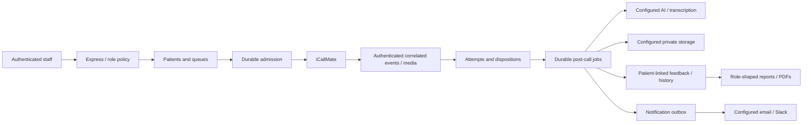

# Application Domain and Access Contracts

Updated 9 September 2026 during remediation. This records implementation decisions and their evidence limits. It does not assert production approval, provider compatibility, legal compliance or completed assurance testing.

## Ownership

| Fact | Authority | Rule |
| --- | --- | --- |
| Patient identity/contact restrictions | `patients` | Queue rows, imports and analysis cannot silently reset restrictions. |
| Scheduled workflow | `customers` / `customer_queue` projection | Multiple workflows may belong to one patient. Changes apply only to the workflow still owned by the attempt. |
| Attempt and provider submission | `calls` plus planned durable attempt fields | Persist identity/reservation before external submission; retries reuse their request identity. |
| Provider transport | Authenticated, correlated events | Connection/answer/completion are distinct. Phone/name/most-recent-row are not event identity. |
| Patient disposition | Explicit statements with attempt provenance | Refusal/wrong-number/callback survive transport completion and stale analysis. |
| Post-call completion | Durable stage jobs | Complete only after required outputs commit; claim tokens fence stale workers. |
| Feedback/history | Patient and originating call | Queue deletion/renaming cannot erase ownership or duplicate automatic effects. |
| Campaign | Immutable campaign ID | Name changes affect labels, not attribution or spend identity. |

## Working access policy

The original intended roles remain ADMIN and AGENT. User instruction to complete remediation supplies implementation discretion; ADMIN-only media/report access announced on 8 September remains the working product choice. A different product decision requires an explicit reviewed response policy, not removal of masking.

| Surface | Anonymous/provider | AGENT | ADMIN |
| --- | --- | --- | --- |
| Login/logout and limited readiness | Public methods only | Allowed | Allowed |
| Session inspection/password change | Denied without valid session | Own account, current state | Own account, current state |
| Patient create | Denied | May enter a contact already known to them; response masked | Allowed |
| Patient list/detail/update | Denied | Mask contacts; cannot change existing phone/email; operational edits allowed | Allowed |
| Patient status/scheduling and queue workflow | Denied | Existing operational permissions, subject to shared contact policy | Same policy; no implicit safety bypass |
| Patient import / legacy CSV | Denied | Denied | Allowed with preview/revalidation and patch semantics |
| Patient/queue/call destructive delete | Denied | Denied | Subject to retention/deletion invariants |
| Call recent/detail/live/incoming | Denied | Permitted operational fields and masked contacts | Full authorized data |
| Recordings/transcripts/analysis/PDF/supervisor payload | Denied | Denied, including inline copies in call JSON | Authorized before file/storage/network work |
| Campaign reads | Denied | Allowed | Allowed |
| Campaign writes, call initiation/escalation/reanalysis, diagnostic calls | Denied | Denied | Shared admission/contact limits still apply |
| Support ticket creation | Denied | Allowed | Allowed |
| Support browsing, users, settings, agents, feedback and logs | Denied | Denied | Allowed |
| Canonical provider callback | Configured credential, not a user cookie | No cookie-based bypass | No cookie-based bypass |
| Legacy callbacks | Disabled by default; explicit enablement plus configured credential | No bypass | No bypass |
| Media WebSocket | Valid scoped media credential and verified attempt correlation | Browser session alone insufficient | Browser session alone insufficient |

Account lookup failures fail closed. Existing session lifetime is 12 hours; current account checks cache at most 30 seconds. Local app account changes invalidate the local cache immediately; other instances/direct SQL changes take effect within 30 seconds. Durable logout revocation, complete route/ID inventory and real-database tests remain P04 assurance work.

## Contact and scheduling decisions

- Canonical consent is `unknown|granted|refused`. At compatibility boundaries, `denied` maps to `refused`, and legacy `pending` maps to `unknown`. Unknown consent retains the existing product behavior; it does not become an implicit grant.
- Explicit refusal, do-not-call, inactivity and wrong-number restrictions block all real outbound entry points. Refusal and wrong-number events also cancel eligible future retry work atomically. A late positive result cannot clear them.
- Only an explicit authorized patient-contact change with the current revision and provenance can relax a restriction. Ordinary imports, queue edits, completed transport and inferred interest cannot do so.
- Preserve current India calling hours, 07:00 inclusive to 21:00 exclusive, using `Asia/Kolkata`. Default daily maximum is 3; configured limits remain explicit. Count patient-linked outbound attempts across deleted queue history, shared normalized contact and every admission path.
- Preserve the configured retry interval, default 180 minutes. A manual action does not implicitly bypass refusal, wrong-number, inactivity, daily limit or capacity. An intentional cooldown override needs an explicit audited decision, not a hidden `is_manual` branch.
- Admission reserves capacity and records an attempt before provider I/O. Uncertain submission remains visible and cannot automatically redial. Unknown provider identity is quarantined; no latest-phone fallback.
- A schedule compares instants in milliseconds. An unchanged instant cannot reset attempts/workflow. An invalid or past requested timestamp remains invalid.
- Import patch: absent column preserves; present blank optional field clears; blank required name/phone rejects. Imports never write consent, suppression or status. A changed row or conflicting identity after preview requires a new preview.

## Data flow and environment boundary

No production/UAT credentials or patient data belong in disposable tests. The user confirmed on 9 September that the deployed database is managed by Supabase. Read-only dashboard inspection then verified both project service-version fields report `17.6.1.166`, establishing PostgreSQL major 17. The disposable `postgres:17.6-bookworm` lab matches that major; Supabase role, extension and permission equivalence remains a separate assessment. Existing Compose shares a proxy/image variable and a Gmail key mount; P03/P06 must replace or verify these before release. Storage permissions, telephony account isolation and notification destinations are not inferred from variable names. No operational provider messages or live calls were sent during this documentation work.

## Retention, rollout and unresolved operational decisions

Preserve the existing configurable retention behavior (default enabled, 10 years) while fixing referential/history correctness; do not run destructive retention/restore exercises against live data. This is the application's current setting, not a legal retention recommendation. Hard patient deletion is refused when retained history requires identity. Temporary audio is deleted only after required durable stages are recoverable.

Initial supported deployment is one app instance per environment. DB admission/job fencing must still withstand multiple workers and restarts. Horizontal scaling, cross-instance media-token routing, higher concurrency and larger workloads need explicit verification before activation.

Operator pause blocks new admissions while retaining authenticated ingestion/reconciliation of in-flight work. Stop-active-calls requires a verified provider hangup capability; a local pause cannot promise the remote call has ended.

Open operational decisions: actual provider capabilities/origins, Supabase role/extension equivalence, permitted concurrency/spend, RTO/RPO, named alert recipients and human review owner, MFA requirement, retention approval and supported device/voice corpus. Technical implementation can use synthetic measured limits; none may be represented as approved production promises. Accountable roles and release triggers remain in the main plan's T/M register.
